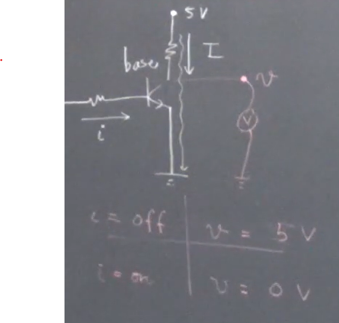
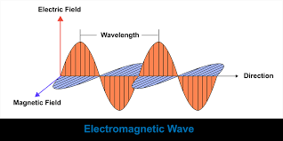
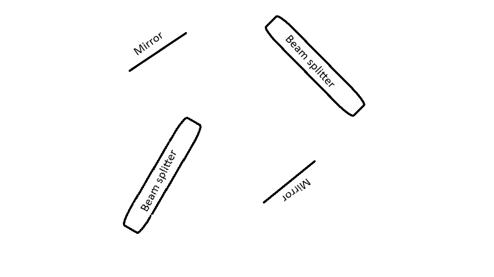

# Quantum Information Science and Technology
We are at the cusp of a second revolution (as far as many experts are concerned). First was at the beginning of the 20th century by Max, Erwin, Weber - and sometimes Albert, who laid the foundations of quanta. Now - in 2026 - we're at the cusp of a second revolution. Because of the new paradigms and development in Quantum Computing and technology. The 2022 and 2025 Nobel Prizes in Physics were given to Quantum Information Science and Technology. This is a preamble. 

A big part of the pre-requisites of QM and modern physics would be explained as this proceeds. 

## Quantum States
Say I have an NPN transistor. Whenever there is a small current $\vec{i}$ coming into the base of this transistor. So whenver this current comes, a larger current $\vec{I}$ can flow through the actual transistor. This is basic working of a transistor. If you were to put a voltage measure near the $IN$ of the transistor, what would you see? If it's OFF, the voltage observed would be the voltage $v$ of the battery (say, 5V) since there is no current. If it (transistor) is ON, the voltage drop should occur across the resistor and the voltage does pass through the circuit so there is no voltage to measure there (assume that a resistor *is* placed on the battery to the IN of the transistor). Let's call these states 1 and 0 respectively. So we can say
| $\vec{i}$ | $v$ | State
| ---- | ----| ---- |
| OFF | 5V | 1 |
| ON | 0V | 0 |

The circuit is as follows:

So we can say the transistor exists in a state 0 or 1. This is a classical device. If this were a quantum object, then we may also come up with ideas analigous to this. 

Say this were a quantum transistor. It would also exist in these two states. This is binary logic -- ie. this has only two configurations. But in the quantum realm we have a habit to use **kets**. So $\ket{0}$ and $\ket{1}$. I have called these 0 and 1. But someone might call this $\ket{\alpha}$ and $\ket{\beta}$. But the main idea is that these are two distinct states. 

### A few more examples
#### Polarisation of a photon
Say, what is light?
- Electromagnetic radiation/waves/fields
- Packets of energy aka Photons

So there are two views of light. One is a wave, another is a packet. 

Say I have a special camera that captures a wave frozen in time. There would be something oscillating. That thing is the *electric field*. This is what Newton and many other scientists dealt with. 

But there is one more, equally strong view. The packet, Photon. They also have the energy. 

For this sinusoidal wave we might even write an equation like $A\cos(kx + \omega{t} + \phi)$ (not too important, a simple Google search away).

And we also know what Time Period, Wavelength and Amplitude (here, the energy). And we know $f_{spatial} = \frac1\lambda$ and $f_{time} = \frac1T$. Now, this was Einstein and Plank's genius that "*if the packet carries the frequency $f$, so its energy is $h f$, where $h \approx 6.63E-34 \text{ }m^2kg/s$. 

Now in the equation $A\cos(kx + \omega t + \phi)$, if we change the $t$, we would see different positions of the wave at different times. 

Also, the photon and the wave are the same just different representations of the same thing. 

Now, is this the *only* direction that the electric field could orient itself?

Now, the orientiation would be the polarisation in the photon and the motion of the wave in the wave. 

Say the horizontal orientation is $\ket{0}$ and vertical $\ket{1}$. Also can use $\ket{H}$ and $\ket{V}$. 

Suppose I have a 1mW laser with the wavelength of 500nm, I could compute the energy the photons as $E = hf$ and the number of photons as $n = \frac{P}{hf}$ . Which would be huge. 

If somehow I were to reduce the number of photons, it would be a quantum object. It'd have these two distinct polarisations, which are **orthogonal** (if a photon is horizontally polarised, it can't be vertically polarised, and vice versa). 

So this polarisation of the photon is one **example of a quantum state**. 

And these could be *any other property* of the photon.

#### Path of a photon 
Suppose I have a device called beamsplitter. What it does is, when light shines on it, half (ideally) of it is reflected and half (ideally) of it is passed. 

Now if I were to repeat this with one photon coming in. There is 50-50 probablity of transmit (pass) and reflect. 

* Just like the [polarisation](#polarisation-of-a-photon), this path of a photon is also a **degree of freedom** which is thesaurus for a measurable distinct property. 

Let's call the transmission $\ket{0}$ and the reflection $\ket{1}$. 

This path of a photon is also an **example of a quantum state**. 

#### Spin of an electron
An electron has some mass and charge. It also has a *spin*. It doesn't literally spin, but it is a term scientists came up with. 

A magnet has some north and south poles - two polar vectors. You can show a magnet with an arrow, a *magnetic dipole*. 

An electron, too, is a very tiny - and unbelievably tiny - magnetic dipole. It is said to be the smallest magnetic movement - the Bohr magneton. 

If I have an electron in a magentic field, the Least Action principle would have it be that the electon points in the direction parallel to that of the magnetic field. Let's call this electron field $\vec{\mu}$ and the magnetic field $\vec{B}$. This is one configuration $\ket{0}$ of this electric field. 

Another possibility is that, for some reason - perhaps some radiation or anything of that sort - this electron points in the opposite direction. Call that $\ket{1}$. 

Of course, the energies are different. $\ket{0}$ is low energy while $\ket{1}$ is high energy.

This spin of electron is also an **example of a quantum state**. 

#### Computers
If we have a quantum register, each bit would be a quantum object. 

We'd have 8 units, each in a certain quantum state. Say the normal register is `[0,0,1,1,0,1,1,0]` (54 in binary, but not important). The quantum register might be $\{\ket{0}, \ket{0}, \ket{1}, \ket{1}, \ket{0}, \ket{1}, \ket{1}, \ket{0}\}$. This would be something like 8 electrons (or ions, or photons) that somehow don't interact with each other. 

Now it would be that each of those bits, is a quantum bit. Again, a **qu**antum **bit**. A **Qubit**. It is a two level system, where we can define the two states - $\ket{0}$ and $\ket{1}$. This is two dimensional - 0 and 1. These can be $n$-dimensional. 

### Is the world classical or Quantum?
The world we live in may seem classical. But it is actually quantum. Classical mechanics is a subset of quantum mechanics. 

We don't see them because we're huge. The average behaviour of quantum particles looks to us as classical. 

Our computers, too, work on the electrons and transistors which are millions in number. But if we had just one of each, the quantum behaviour would manifest. 

## Superposition
When dealing with quantum states, we use the Greek letter Psi ($\Psi$ or $\psi$). Since it is a quantum state, we put it in kets so we get $\ket{\Psi}$. These kets are from kets and bras notation by Paul Dirac. So it is called **Dirac's bra and ket notation**. 

So $\ket{\Psi}$ is used to denote quantum state. For a qubit it might be $\ket{0}$ and $\ket{1}$ (at two levels). 

If we go back to our transistor example. Either it is ON or it is OFF. They are mutually exclusive. In a classical world, say standing, I can either stand on the ground or on a chair. Not half way, assuming of course I don't want to fall. But quantum objects don't have that. Quantum objects can be in superpositions. 

Meaning, the quantum state need not be $\ket{0}$ OR $\ket{1}$. It could really be some superposition of 0 and 1. For instance
$$
\ket{\Psi} = c_0\ket{0} + c_1\ket{1}
$$
where $c_0, c_1 \in \mathbb{C}$. Yes, they are complex, it is due to Descartes that we call $i$ *imaginary*, if he had known the significance they'd likely be something like *rotational numbers*. But that is a different topic.  

A quantum object can be a superposition of 0 and 1 at **the same time**. 

Other than being complex, the coefficients would need to have more properties but they have to do with probablity so I'll deal with them later. So that is the most general way to write a qubit. Observation also changes this superposition, but that too is a topic for later. 

One example might be $c_0 = 0, c_1 = 1$, you get $\ket{1}$ to be your state *for sure*. You change $c_0 = 1, c_1 = 0$, you get $\ket{1}$ to be your state *for sure*. 

Suppose, $c_0, c_1 = \frac{1}{\sqrt{2}}$. This is a more exciting and intresting example than simple 0/1. Then my superposition becomes
$$
\ket{\Psi} = \frac{\ket{0}}{\sqrt{2}} + \frac{\ket{1}}{\sqrt{2}}
$$
This is a **superposition**. 

One more exciting example might be $c_0 = \sqrt{\frac13}$ and $c_1 = \sqrt{\frac23}e^{i\frac\pi{3}}$. Both of these are complex numbers. Then my quantum state becomes
$$
\ket{\Psi} = \frac{1}{\sqrt{3}}\ket{0} +  \sqrt{\frac23}e^{i\frac\pi{3}}\ket{1}
$$

Let's go back to the [path of a photon](#path-of-a-photon). If I send a single photon in an ideal beam splitter, there is $\ket{0}$ that it transmits and $\ket{1}$ that it reflects. 

I want to measure this. Note that every word in quantum mechanics - measure, superposition, state, is - have a lot of philosophy behind them, not you ideal dictionary definition **sometimes**. 

To measure, I'll place a detector. What it does is *click* when a photon passes through it. I'll place two - one on $\ket{0}$ and one on $\ket{1}$. Call them $D_0$ and $D_1$ respectively. These are not theoretical as they were when in 20th Century they were imagined, they are common nowadays in labs. Our eyes, while are good, can detect at minimum 40-50 photons (maybe, I'm not an optician). Some animals living in the deep ocean *might* have eyes that detect single photons or a couple of photons. 

In an ideal beamsplitter, the probablity of either detectors clicking is 50/50. 

Say I have following setup:

(excuse the bit of crooked drawing)

The mirrors and the beamsplitters are ideal in this case, so the mirrors *perfectly always* reflect *every* photon. 

Suppose a photon is incident on the left beamsplitter. There is a 50% chance that it is reflected and a 50% chance that it is transmitted. 

Then it goes to mirror (right if transmitted, left if reflected) and from (both) paths it goes into the second beamsplitter. Assume I keep a detector $D_0$ on the transmitted path of the second beamsplitter and $D_1$ on the reflected path thereof. 

This special arrangement is called a **Mark-Zehndar Interfrometer**. 

(ignore some crooked angles)

What is $P(D_0)$ and $P(D_1)$? There is 50-50 probablity of each route. There are actually four 25-25-25-25 because there are 4 paths where the probablity enters, but they add up to 50-50 or half-half. 

But this doesn't happen in reality. This will be much more in detail in the next one. 