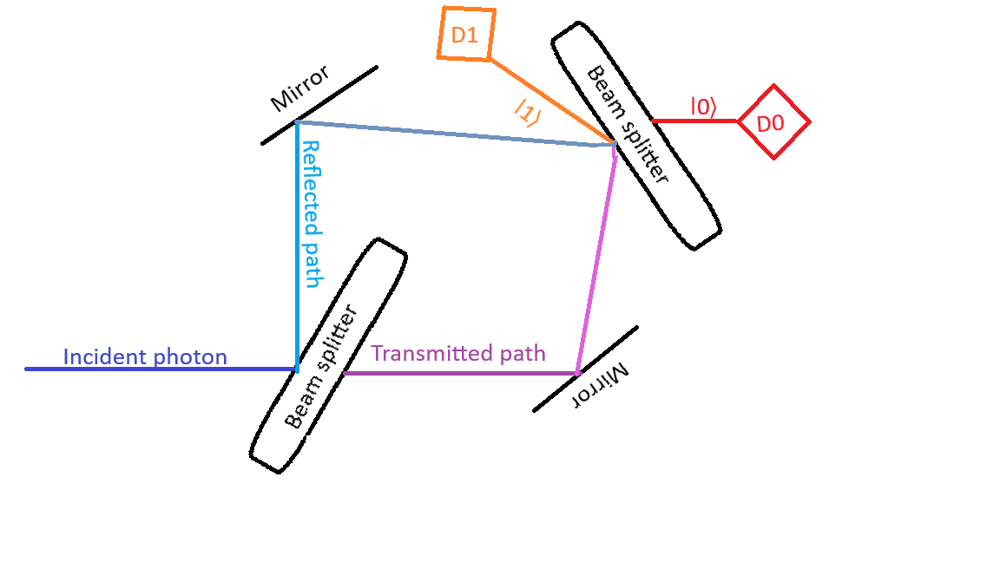
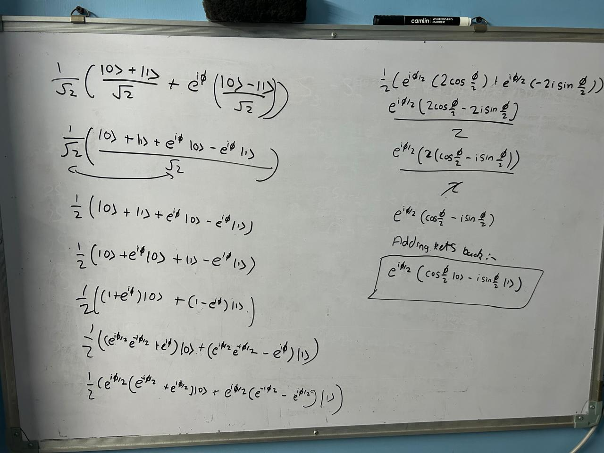
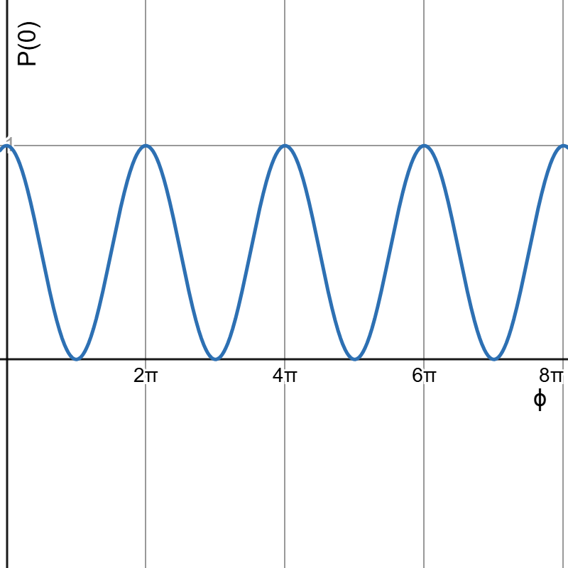
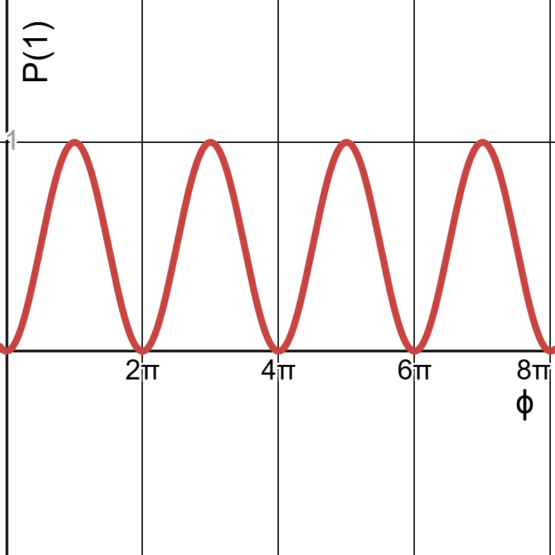
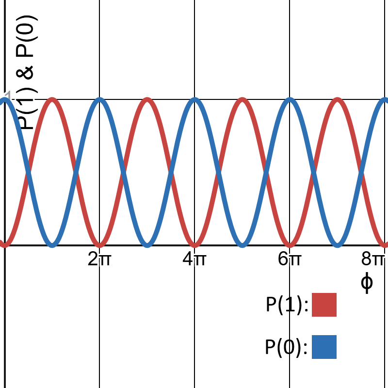

(continuing from the Mark-Zehnder Interferometer)

A photon can't be split, under normal physcis. 

In order to find probabilities, we repeat experiment multiple times. If we want a-priori probabilities, then QM can acertain you what the probablities are. 

Jsut like logic gates, when you input something through a beamsplitter, it can give these outputs
$$
\ket{0} \rightarrow^{BS} \frac{\ket{0} + \ket{1}}{\sqrt{2}}
$$

Say a NOT gate, you don't just describe what it does to a single input. You have to describe what it does to an orthogonal input too. Similarly, the beamsplitter does a similar thing but subtraction
$$
\ket{1} \rightarrow^{BS} \frac{\ket{0} - \ket{1}}{\sqrt{2}}
$$

The reason why there is $\sqrt{2}$ in the denominator is because our $c_0 = c_1 = \frac{1}{\sqrt{2}}$. In the second case, $c_1 = -\frac{1}{\sqrt{2}}$. This is what would happen at the first beamsplitter. If the second one is identical, it'd do the exact same thing. 

In quantum circuits, this sort of gate is called a **Hadammard Gate**. The beamsplitter does the Hadammard gate. It is represented by **`H`**. So those equations are the transformation that the Hadammard gate does and in our example they are executed by the beamsplitter. 

Let's trace the path of the photon. 

So our photon enters in $\ket{0}$. So 
$$
\ket{0} \rightarrow^{BS_1} \frac{\ket{0} + \ket{1}}{\sqrt{2}}
$$

A superposition. What happens here is, let's call the transmitted path $\ket{0}$ and the other $\ket{1}$. So what happens here is NOT that it exists in *either* of those. It is that in exists in BOTH of those. This is what $\ket{0} + \ket{1}$ means. It is a quantum field, you can't attach a path to it. It essentially takes both parts at the same time - speaking loosely. The photon is a field spread out in both of these paths. Let's look at $BS_2$. 

QM by nature is linear. If you have an input, you have an output. If you have $\sum inputs$, you have $\sum outputs$. This is what linearity is. 

The second BS applies a transformation to $\ket{1}$ and $\ket{0}$ in parallel. So the transformation of $\ket{0}$ is applied to it, and the transformation of $\ket{1}$ is applies to it, obviously the factor of $\frac{1}{\sqrt{2}}$ comes out. So
$$
\ket{0} \rightarrow^{BS_1} \frac{\ket{0} + \ket{1}}{\sqrt{2}} \rightarrow^{BS_2} \boxed{\frac{1}{\sqrt{2}}\Big(\frac{\ket{0} + \ket{1}}{\sqrt{2}} + \frac{\ket{0} - \ket{1}}{\sqrt{2}}\Big)}
$$

The $\ket{1}$ cancels out from both sides and we are left with $\ket{0}$. 

From this we conclude that in the arrangements, ignoring experimental errors, the photon will **never** go on $\ket{1}$. And the probablity of $\ket{0}$ clicking is 100%.

If we repeat this process with identical photons, we get always $\ket{0}$ and never $\ket{1}$. This is the simplest Quantum Computer you can think of. Why? Later. 

There is constructive interferance at $\ket{0}$ and destructive interferance at $\ket{1}$. This is what the $+$ and $-$ signs represent in the equations. These coefficients may seem arbitrary, but this is just how the beamsplitter is defined.  

Now say I put a, say piece of glass, in one of the paths, say for instance the path between the upper mirror and $BS_2$. Something transparent. This medium is defined as $\ket{0} \rightarrow^{Phaser} \ket{0}$. Call this a phaser. not to be confused with phasor. 

But to $\ket{1} \rightarrow^{Phaser} e^{i\phi}\ket{1}$. where $\phi \in \mathbb{R}$. 

My input state is $\ket{0}$. I don't measure anywhere in the setup. I let it do its thing. Note that $\phi$ is the symbol for this gate like `H` for the Hadammard. So 
$$
\ket{0} \rightarrow^{BS_1} \frac{\ket{0} + \ket{1}}{\sqrt{2}} \rightarrow^{\phi} \frac{1}{\sqrt{2}}(\ket{0} + e^{i\phi}\ket{1})
$$

All the gates we talk about here are single qubit gates. So one qubit in, one qubit out. After the phaser, $\frac{1}{\sqrt{2}}(\ket{0} + e^{i\phi}\ket{1})$ is the state of the photon, though we don't measure it, whatever. When it passes through the $BS_2$,
$$
\frac{1}{\sqrt{2}}(\ket{0} + e^{i\phi}\ket{1}) \rightarrow^{BS_2} \boxed{\frac{1}{\sqrt{2}}\Big(\frac{\ket{0} + \ket{1}}{\sqrt{2}} + e^{i\phi}(\frac{\ket{0} - \ket{1}}{\sqrt{2}}) \Big)}
$$
And expanding it out
$$
\frac12\Big((1 + e^{i\phi})\ket{0} + (1 - e^{i\phi})\ket{1} \Big)
$$

If I just do something cheeky for the fun of it
$$
e^{i\frac\phi2}\Big[\big(\frac{e^{i\frac\phi2} + e^{-i\frac\phi2}}{2}\big)\ket{0} + \big(\frac{e^{-i\frac\phi2} - e^{i\frac\phi2}}{2}\big)\ket{1} \Big]
$$

Simplyfying
$$
e^{i\frac\phi2} \Big[\cos\frac\phi2 \ket{0} - i\sin\frac\phi2 \ket{1} \Big]
$$

Now this calculation is difficult, so here's how it was derived from the step ${\frac{1}{\sqrt{2}}\Big(\frac{\ket{0} + \ket{1}}{\sqrt{2}} + \frac{\ket{0} - \ket{1}}{\sqrt{2}}\Big)}$

(it makes use of Euler's formulae of $\cos$ and $\sin$ from terms with $e$. Notably: $\cos x = \frac{e^{ix} + e^{-ix}}{2}$ and $\sin x = \frac{e^{ix} - e^{-ix}}{2i}$ in their variations.)

Now, obviously $c_0 = \cos\frac\phi2$ abd $c_1 = - i\sin\frac\phi2$ and $e^{i\frac\phi2}$ is just a factor. 

Now you can only obviously only ever know the probabilities of the events in QM. 

So the probablity of $D_0$ clicking is given by an overlap of the quantum state ($\ket{\Psi}$) and the coefficient of $\ket{0}$.If say I have a $\vec{a}$ and $\vec{b}$ and I want to find out how much $\vec{a}$ does be $\vec{b}$ contain, I'd take the dot-product - $\vec{a} \cdot \vec{b}$. I'd do the same thing with $\ket{\Psi}$ and $\ket{0}$. I take the analigous of the dot product in Hilbert space instead of Euclidean space. That is called an **inner product**. So I find the inner product of the quantum state with the corresponding to the outcome of which I am trying to find the probablities of. 

So the 
$$
\text{Inner product}(\ket{\Psi}, \ket{0}) = \bra{0} \ket{\Psi}
$$
Where, as mentioned in the name Dirac's Bra and Ket notation - $\bra{0}$ is the bra in this case. 

(the second line of the bra is not usually drawn to avoid clutter)

And to find the probablity I take the modulus square of this Inner Product so 
$$
P(0) = |\bra{0}\ket{\Psi}|^2
$$

To find this inner product, we need rules. If I have 
1. $\bra{1}\ket{1} = 1$
2. $\bra{0}\ket{0} = 1$
3. $\bra{0}\ket{1} = \bra{1}\ket{0} = 0$
    * (3) means $\ket{0}$ and $\ket{1}$ are othogonal. In Eucliean space this'd be $\vec{a} \perp \vec{b}$. This breaks down in QM because we don't deal with Euclidean space, we deal with Hilbert space.

The overlap here would be equal to the coefficient of $\ket{0}$

So here it'd be $\bra{0}\ket{\Psi} = e^{i\phi}\cos\frac\phi2$ and the probablity of this would be $\cos^2\frac\phi2$. Technically it is $e^{-i\phi}e^{i\phi} \cos^2\frac\phi2$ but that cancels out. 

Similarly the probablity that $D_1$ clicks is simply $\sin^2\frac\phi2$ since the $i$'s cancel out. More specifically it (on squaring) becomes $-(-1)\sin^2\frac\phi2$ or just $1\sin^2\frac\phi2$ or $\sin^2\frac\phi2$. 

(remember: $probablities \in \mathbb{R}$ always)

Adding these, $\cos^2\frac\phi2 + \sin^2\frac\phi2 = 1$. 

If I had not chosen the factor of $\frac{1}{\sqrt{2}}$, these wouldn't be 1.

The sum of these probablities **have** to add upto one. $c_0, c_1 \in \mathbb{C} \implies |c_0|^2 + |c_1|^2 = 1 $. They have to, obviously. Therefore, for any $\Psi$, $|\bra{\Psi}\ket{\Psi}|^2 = 1$. This means the state is **normalised**. 

And it might be obvious, you can ignore that $e^{i\phi}$. since it gets cancelled out in the squaring anyways. It doesn't show up in outcomes, not in a way that matters anyway. It is a **global phase**.

So technically
$$
\ket{\Psi} = e^{i\phi}\ket{\Psi}
$$

We notice the following three things

1. State normalised
2. Global phases ($e^{i\alpha}$) are mostly immaterial
3. The phase *really* matters a LOT. It is a relative phase between components of the superposition. Remember $\frac{\ket{0} - \ket{1}}{2}$? $\phi$ there was $\pi$. So $e^{i\pi} = -1$, which was why it was $-$. This stuff is what makes this, and any other quantum computing experiment, really interesting. So relative phases matter A LOT.
4. Probablity, $P_\Psi(\beta) = |\bra{\beta}\ket{\Psi}|^2$

Now if say I were to change the $\phi$ in the phaser, what would the graph of $P(0)$ and $P(1)$ look like? As in, probablities vs phaser angle. Well, if we let the x-axis be the angle and y be the probablity of $D_0$ clicking, the graph looks like this:

And the probablities for $D_1$ clicking would be

And plotted together for clarity would be

Just by tweaking $\phi$ I can determine where the photon ends up.

We have seen also:
5. Quantum interferomertery

Also, these curves are complimentary. So their sums are always one and if one goes up, the other goes down.

Now what is interfering it? The photon itself. This is a display of its wave nature as well. It is everywhere. You can link this to Quantum Feild Theory. 

And we 
6. introduced the concept of quantum gates.

This is literally a quantum computer. You initialise (here, make the setup), you do some transformations (here, Hadamard and phaser) and then at the end, some interference of the outcomes among themselves, some probablities, and finally... you measure. And you do that in a way that nothing is measured in between. If you measure, the superposition collapses. If you place a detetector $D_2$ near the, say reflected path of the $BS_1$. If that clicks, you get nothing in $D_0$ or $D_1$. The very act of measurement, demolishes the photon (and its superposition). Even if doesn't click, only 50/50 chances that $D_0$ and/or $D_1$ clicks. The intresting stuff, the superposition, goes away. Because you blocked the path. It is like you make garbage policies and wonder why people want to overthrow you. 

And thus in this, we also talked about
7. Bohr's complimentarity. 

It means "which path" information and the interferance are mutually exclusive. If I were to see interferance, I don't know where the photon came from. If I see where it is coming from, I don't get interferance. In the word's of the great Bohr himself: "The opposite of a profound truth may well be another profound truth." and “We are both spectators and actors in the great drama of existence.” These give a good idea about the complimentarity. 

If we were to ask Werner Heisenberg on this, he'd say *the momentum and the position are mutually excluisve*. Or
$$
\Delta x \Delta p \geq \frac\hbar2
$$

You can imagine the momentum of a photon to do with interferance. And $x$. obviouslt the position.

This one example has demonstrated to us all of these 7 things. 

So far we have talked only a single Qubit. 

But if in QIT (or QIS) someone wants to represent a qubit. You construct a sphere with a horizontal sphere in it. Call it **Bloch sphere**. This is the surface of this sphere. Let $\ket{0}$ be the North pole and $\ket{1}$ the South pole of this. Let the radius be 1. So you need 2 co-ordinates to describe a point. 

Say the point facing towards, then, has to be $\frac{\ket{0} + \ket{1}}{\sqrt{2}}$. These have to add up to 1, so it can't be $\frac12$. The diametrically opposite would be $\frac{\ket{0} - \ket{1}}{\sqrt{2}}$. You can check these are orthogonal by taking the inner product. Because they are the same, you get 0. Just that the sign with change so
$$
\Big(\frac{\ket{0} - \ket{1}}{\sqrt{2}}\Big)\Big(\frac{\ket{0} + \ket{1}}{\sqrt{2}}\Big)
$$

(See: [Bloch Sphere.md](./Bloch%20Sphere.md))

Now lets verify if ONLY $\sqrt{2}$ denominator and the sets of equations work.

let $\sqrt{n}$ be denominator.

This will make fractions of state in outputs, that don't add up to 1. So impossible.

The equations have to be as they are. even if the input is say $\ket{1}$, the output in these is still $\ket{0}$. If you switch the equations around, $\ket{0}$ becomes the destructive interferance and $\ket{1}$ the constructive, in such case $\ket{0}$ becomes impossible and $\ket{1}$ outputs $\ket{0}$.