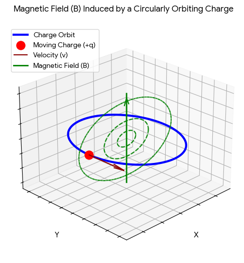

We have already seen a MZI. 

Another example.

The nucleons, electrons, protons, photons - they have a property called **spin**. It makes it act like a magnet. If we were to symbolise take an electron with a $\vec{\mu}$ and then see how it behaves in a magnetic field. 

Let's take a charge $q$ moving in a cicle with radius $r$ with a velocity $v$. It is a current - $\iota$ (not to be confused with $i = \sqrt{-1}$). This current will act like a magnet. 

If i were to look at the magnetic dipole movement $\mu$ and to quantify it, not the vector but the scalar, it'd be $\mu = \iota \pi r^2$. Current $\times$ area. Unit is obviouslt Ampere-meter^2. We can also assosiate $\iota = \frac{q}{\Delta t}$ which we can simplify as $\iota = \frac{qv}{2\pi r}$. So putting this in the $\mu = \iota\pi{r^2}$,
$$
\mu = \iota\pi{r^2} \\
\mu = \frac{qv}{2\pi{r}} \pi{r^2} \\
\mu = \frac12 qvr
$$

add a term of mass $m$:
$$
\mu = \frac{q}{2m} (mvr) \quad \text{(}mvr \text{ is angular momentum)} \\
\therefore \vec{\mu} = \frac{q}{2m} \vec{L}
$$

If this electron is in an atom, in an orbit, it's anglular momentum ($L$) has to be quantised. It is simply
$$
L = m_\ell\hbar \quad, m_\ell \in \mathbb{Z}
$$
(quantised just means the angular momentum can't be *any* number, it has to be an integer)
So
$$
\vec{\mu} = \frac{q}{2m} m_\ell\hbar \\
\vec{\mu} = \frac{q\hbar}{2m} m_\ell
$$

If $m_\ell \in \mathbb{Z}$, then this $\vec{\mu}$ is also quantised. 

An electron, or a proton, also has a momentum in addition to the oribital/angular momentum. This momentum in question *is called the **spin***. If you have an electron, outside an atom, just chilling in quantum space, it'll still have angular momentum called the spin.

In the lowest shells of the atom (closest to the nucleus also known as K shell), $L = 0 \implies m_\ell = 0$ but still there is some magnetism associated with the electron. That magnetism comes from spin. So just like the aforementioned $\vec{\mu_l} = \frac{q}{2m} \vec{L}$, we can also have
$$
\vec{\mu} = \frac{q}{2m} \vec{S}
$$
(Spin as a quantum operator)

Now the proportionality fails a bit here because this is for *literal* spin (like if electrons did a day-night cycle). This causes many problems. So we need a constant $g$.
$$
\vec{\mu} = g\frac{q}{2m} \vec{S}
$$

The $g$ is called the Lande-g constant. It comes from atomic physics, it goes outside QIST so not my concern *right now*, per se. [Wikipedia](https://en.wikipedia.org/wiki/Land%C3%A9_g-factor). 

But whenever you have spin, you'll have spin and vice versa. A magnetic dipole always comes with a spin. 

Let's say for a proton $q = +e, m = m_p, g \approx 5$. I have not used the precise mass of the proton because it *is* the base of mass of an atom (basic class 9th) and the $g$ comes out to be $5$ from experiments. 

So it becomes the following for a proton:
$$
\vec{\mu} = \frac{ge}{2m_p} \vec{S}
$$

Now, how do you know this magnetic field exists? Experiments. When you pass protons (or electrons) through an inhomogenous magnetic field, the beam of protons splits. This is called the [Stern-Galerch experiment](https://en.wikipedia.org/wiki/Stern%E2%80%93Gerlach_experiment). So you can do experiments for this. What relation does this have with my field, quantum computing (and science and theory thereof)?

Suppose we have a proton, let it have a $\vec{\mu}$ magnetic movement (where it comes from is atomic physics). How will our proton respond to this? It will align itself with the magnetic field. There is also one more possibility, it rebels and aligns itself opposite to the field. Preferance is to align with the magnetic field, because of Least Action. A compass aligns itself to north-south because of this. (Actually in India, it might not.) 

Physics gives us relationship between this $\vec{\mu}$ and the field $\vec{B}$. It is their product, in negative. Because the alignment makes the energy go down, and non alignment would bring it up etc. 
$$
E = - \vec{\mu} \cdot \vec{B}
$$

We can represent this energy of this proton spin inside the magnetic field can be represented by two levels. One being aligned, other being anti-aligned. Let's call the energy gap between them $\Delta E$. The lower (energy) one would be parallel and the higher anti-alignment. So it will be:
$$
E = 2\mu B
$$
(vectors removed, energy is a scalar)

The higher energy would be $+\mu B$ and the lower $-\mu B$ because of $\cos 180 = -1$ and $\cos 0 = 1$ (180 and 0 in degrees; $\pi$ and $0$ in radians; they are the angles of the proton with the field). 

Any energy would be written as $\hbar\omega$ or $hf$. Associated with energy, is the frequency. So we can, as one does on seeing two orthogonal states, assign each of these a quantum ket. Let the lower energy ($+\mu B$) be $\ket{0}$ and the other $\ket{1}$.

Orthogonality in the Hilbert space doesn't necesserily mean 90deg rotations. 

Now we bring out the Bloch sphere again. Now when we have this that can be written as that:
$$
\text{We have } E = -\vec{\mu}\cdot{\vec{B}} \\
\text{Rewrite: } E = \pm \frac{\hbar\omega}{2}
$$
The $\pm$ sign because of $\pm \mu B$, our quantum states. 

On our Block sphere, we have the general quantum state as $\ket{\Psi} = c_0 \ket{0} + c_1 \ket{1}$ where $c_0, c_1$ are probablity amplitudes and normalisation constraints. Now this physically means, spin is in a superposition. We're defining the $\ket{0}$-$\ket{1}$ axis with the orientation of this magnetic field. 

A proton is a spin half particle. Meaning, if you put it in a magnetic field, you get two possible paths for it. This is given by the $\frac12$. 

Say you have a particle $s$, you will get $(2s + 1)$ levels when placed in a magnetic field. This may appear in the study of the hydrogen atom.  

If you don't have a magnetic field, you don't get a direction. Space is isotrophic. If you have say a magnetic field in $z$ direction (may or may not be the z-axis), you can have the spin in the $z$ directions:
$$
\mu_z = \frac{ge}{2m_p} S_z
$$

But $S_z$ has to be quantised, so
$$
\mu_z = \frac{gem_s\hbar}{2m_p} \\
\mu_z = g\hbar \Big(\frac{em_s}{2m_p}\Big) \quad \text{(Factor out the constants)}
$$

You can put in the values for $\hbar$, $g$, mass of the proton and the charge to get this, which is a really small number. It comes out in the following expression:

---
$$
\mu_z=\frac{ge m_s \hbar}{2m_p}
$$

Using

$$
g \approx 5,\quad
e = 1.6\times10^{-19}\,\mathrm{C},\quad
m_s=\frac12,\quad
\hbar \approx 1.06\times10^{-34}\,\mathrm{J\cdot s},\quad
m_p \approx 1.67\times10^{-27}\,\mathrm{kg}
$$

Substituting the values:

$$
\mu_z
=
\frac{(5)(1.6\times10^{-19})\left(\frac12\right)(1.06\times10^{-34})}
{2(1.67\times10^{-27})}
$$

Separating the numerical factors and powers of ten:

$$
\mu_z
=
\left(
\frac{5\times1.6\times0.5\times1.06}{2\times1.67}
\right)
\times
10^{-19-34+27}
$$

$$
=
\left(
\frac{4.24}{3.34}
\right)
\times10^{-26}
$$

$$
\mu_z \approx 1.27\times10^{-26}\,\mathrm{J/T}
$$

---

Similar can be done for an electron:
$$
\frac{\pm g\hbar e}{2\cdot 2m_e} = \pm \frac{\hbar e}{2m_e} = \pm \mu_B
$$
($g \approx 2$ for electron)

This is the smallest unit of magnetism - Bohr Magnetron $\mu_B$.

This $g$ is one of the best known constants in physics. There's fine corrections to this.

Now we know that the magnetic value can take two values for an electron or a proton. 

If you have electrons or protons coming into a beam, the beam will split in two. Because the energies are different because the force is related to the energy. There will be a positive force and a negative force. 

You get two spots if you were to detect them. This was the Stern-Galerch. This was how spin was discovered. 

Say you have two energy levels - a low $E_1$ and a high $E_2$ - with the system being at some temperature. At 0K, only $E_1$ is populated. So the distribution becomes:
$$
f_1 = \frac{\exp(-\frac{E_1}{k_BT})}{\exp(-\frac{E_1}{k_BT}) + \exp(-\frac{E_2}{k_BT})}
$$
where $k_B$ is the Boltzman constant, $T$ is the temperature (in Kelvin).

This is just for the probablity at $E_1$.

If you were to plot this at 0K, you'd get a 1 and then it gradually decreases (given the plot is temperature vs probablity).

Armed with this, let's move to dynamics.

We generally have an equation of motion. 

What does dynamics mean? change in time. 

Whenever something changes in time, you have an equation of motion. For instance, Newton's Second Law - $F = m\frac{d^2x}{dx^2}$. 

What is the analogious equation in this field? The **Schrödinger Equation**. 

The time dependant Schrodinger equation is:
$$
\boxed{
i\hbar\frac{d}{dt}\ket{\Psi(t)} = \hat{H}\ket{\Psi(t)}
}
$$

It is the equation of motion for a quantum state. The $\hat{H}$ is the Hamiltonian. It is an energy operator. We already saw what the energy is - $(-\mu \cdot B)$. So the energy will be some eigenvalue of this Hamiltonian. We need to find an equation for this Hamiltonian. 

First let's find *a* solution for this. Say I have a constant $a$. Say I do this:
$$
a\frac{dy(t)}{dt} = by(t)
$$
This is a differential equation. $a, b$ are constants, $y$ is a function of time.

This looks similar to the Schrodinger equation. 

What is the solution for this? An expression for what $y$ is in time. 
$$
y(t) = y(0) \exp(+\frac{b}{a}t)
$$

Similarly, let's write a solution for the Schrodinger. Shouldn't it be:
$$
\boxed{
\ket{\Psi(t)} = \ket{\Psi(0)}\exp\Big(-\frac{i\hat{H}t}{\hbar}\Big)
}
$$
(the $i$ was in the denominator, but i moved it up just because i can)

---

Let's take the derivative at both sides to see if the Schrodinger equation can pop out.

Start with

$$
\ket{\Psi(t)}
=
\exp\Big(-\frac{i\hat{H}t}{\hbar}\Big)\ket{\Psi(0)}
$$

Now differentiate both sides with respect to time:

$$
\frac{d}{dt}\ket{\Psi(t)}
=
\frac{d}{dt}
\left[
\exp\Big(-\frac{i\hat{H}t}{\hbar}\Big)
\right]
\ket{\Psi(0)}
$$

Since $\hat H$ is assumed to be time-independent,

$$
\frac{d}{dt}
\exp\Big(-\frac{i\hat{H}t}{\hbar}\Big)
=
-\frac{i\hat H}{\hbar}
\exp\Big(-\frac{i\hat{H}t}{\hbar}\Big) \quad \Big(\because \frac{dy^x}{dx} = y^x \ln(y) \text{ and } \ln(\exp(x)) = x\Big)
$$

Therefore,

$$
\frac{d}{dt}\ket{\Psi(t)}
=
-\frac{i\hat H}{\hbar}
\exp\Big(-\frac{i\hat{H}t}{\hbar}\Big)
\ket{\Psi(0)}
$$

But

$$
\exp\Big(-\frac{i\hat{H}t}{\hbar}\Big)\ket{\Psi(0)}
=
\ket{\Psi(t)}
$$

so we get

$$
\frac{d}{dt}\ket{\Psi(t)}
=
-\frac{i\hat H}{\hbar}\ket{\Psi(t)}
$$

Multiplying both sides by $i\hbar$ gives

$$
i\hbar\frac{d}{dt}\ket{\Psi(t)}
=
\hat H\ket{\Psi(t)}
$$

which is the time-dependent Schrödinger equation:

$$
i\hbar\frac{\partial}{\partial t}\ket{\Psi(t)}
=
\hat H\ket{\Psi(t)}
$$
---

What does this mean? It means you start off with a state $\ket{\Psi(0)}$ and over time, the state evolves into another. On the Bloch Sphere, you start with a state of $\Psi$ at 0, then the Hamiltonian - which comes from the magnetic field - acts on it, due to the effects of which, the state is made to evolve into another. It takes some trajectory (dependant upon Hamiltonian) and lands somewhere (else)  on the Bloch Sphere. So we can say that $\hat{H} \text{ generates time evolution}$. 

Now, the energy of a particle in the magnetic field is given by the aforementioned $\frac{\hbar\omega}{2}$. But the magnetic field can be in different directions, and the Hamiltonian has to be an operator as well. 

Say you have a magnetic field in the $z$-direction (ie. $\hat{z} \parallel \vec{B}$). So it'll be given by
$$
\hat{H} = \frac{\hbar\omega}{2} \hat{\sigma}_z
$$

Similarly for $x$-direction, it'll be
$$
\hat{H} = \frac{\hbar\omega}{2} \hat{\sigma}_x
$$

Where $\omega \propto \vec{B}$ becasue:
$$
\text{Since } E = 2\mu B = \hbar\omega \\
\omega = \frac{2\mu}{\hbar}B
$$

Stronger magnetic field, the higher the frequency. So now we have a way to determine the Hamiltonian by the direction of the magnetic field and the strength of the magnetic field. And $\omega$ is proportional to the strength. This is called the [Zeeman effect](https://en.wikipedia.org/wiki/Zeeman_effect). 

Coming back to our example of the two energies - $\pm \mu B$. If the magnetic field is higher, the gap will get higher. This is also in the Zeeman effect. If there was no magnetic field, these two levels go kaput and quantum computing goes away. 

So if we just let $\hat{z} \parallel \vec{B}$, so our Hamiltonian is the one we saw earlier. So our initial $\ket{\Psi(0)}$ and we multiply our sweet exponent:
$$
\ket{\Psi(t)} = \exp\Big(-\frac{i\hbar\omega t}{2\hbar} \hat{\sigma}_z \Big) \\
\boxed{
\ket{\Psi(t)} = \exp\Big(-\frac{i\omega t}{2} \hat{\sigma}_z \Big)
}
$$

where $\omega = -\gamma B$ where $\gamma$ is called the [Gyromagnetic ratio](https://en.wikipedia.org/wiki/Gyromagnetic_ratio). It comes from geometric physics, it depends upon the Bohr magnetron etc. Not my concern!

Is this - $\ket{\Psi(t)} = \exp\Big(-\frac{i\omega t}{2} \hat{\sigma}_z \Big)$ - a unitary operator? Yes. Because:
$$
\exp\Big(-\frac{i\omega t}{2} \hat{\sigma}_z\Big)^\dagger
=
\exp\Big(+\frac{i\omega t}{2} (\hat{\sigma}_z)^\dagger\Big)
=
\exp\Big(+\frac{i\omega t}{2} \hat{\sigma}_z \Big) 
\quad \text{( }\because \sigma_z^\dagger = \sigma_z \text{ )}
=
\exp\Big(-\frac{i\omega t}{2} \hat{\sigma}_z \Big)^{-1}
$$

Therefore it is unitary. 

Is the evolution unitary? Yes. How do I reverse it? I let time run backwards...or change the sign of the frequency. Is it a rotation operator? Yes, because you have an axis of rotation ($z$-axis) and you have an amount ($\omega t$). Our definition for rotation is $\hat{R}_\alpha(\beta) = \exp\Big[-i\beta \big(\frac{\hat{\sigma}_\alpha}{2} \big) \Big]$. If we are talking about single-qubits, every unitary operation is rotational on a Bloch Sphere. 

If I start off at $\ket{0}$, and turn on the magnetic field $B$. There will be an $\omega$ associated with it. There will be a Hamiltonian switched on with it. That Hamiltonian will act rotationally. That would be
$$
\hat{H}(t > 0) = \frac{\hbar\omega}{2} \hat{\sigma}_z
$$

On switching it on, there will be things in motion that can/cannot be undone. 

In this case they won't evolve. The rotation is about $z$-axis, $\ket{0}$ won't evolve. This $\ket{0}$ is an eigenstate of this Hamiltonian. Let's write it as a matrix:
$$
\hat{H} = \frac{\hbar\omega}{2} \begin{bmatrix} 1&0 \\ 0&-1 \end{bmatrix}
$$
What are the eigenstates? It has two: $\begin{bmatrix} 1\\0 \end{bmatrix}$ and $\begin{bmatrix} 0\\1 \end{bmatrix}$. Now, these are our $\ket{0}$ and $\ket{1}$.
$$
\ket{0} = \begin{bmatrix} 1\\0 \end{bmatrix} \\
\ket{1} = \begin{bmatrix} 0\\1 \end{bmatrix}
$$

So if your quantum state is either of $\ket0$ or $\ket1$, it won't evolve if the transformation is about the $z$-axis. If the quantum state is an eigenstate of the Hamiltonian, the energy remains a constant. This is called the [Noether's theorem](https://en.wikipedia.org/wiki/Noether%27s_theorem). If the state doesn't change in time, it's an eigenstate!

If i put the magnetic field in another direction. Let's say $\vec{B} \parallel \hat{x}$. Now the state evolves. So no longer would it be eigenstate. 

Hot take: most of single qubit-QIT can be translated to classical mechanics. 

So now,
$$
\hat{H} = \frac{\hbar\omega}{2}\hat{\sigma}_x = \frac{\hbar\omega}{2}\begin{bmatrix}0&1\\1&0\end{bmatrix} \implies \ket{\Psi(0)} = \ket0 = \begin{bmatrix}0\\1\end{bmatrix} \\
\ket{\Psi(t>0)} = \exp(-\frac{i\omega t}{2} \hat{\sigma}_x)\ket0
$$

So when it starts moving (on the Bloch Sphere), it moves $\frac\omega t$. If it moves to some place from $t=0$ to $t=T$, the angle between $\ket0$ and the new position will be $\omega T$. 

---

btw, when I say "acts", it's really not that complex. All of this is linear algebra in disguise. So, take our $\exp(-\frac{i\omega t}{2} \hat{\sigma}_x)$. we can expand it out:
$$
\Big[
    \cos\big(\frac{\omega t}{2}\big) \hat{I} - i\sin\big(\frac{\omega t}{2} \hat{\sigma}_x)
\Big] \ket0 
$$
And at $t=T$,
$$
\Big[
    \cos\big(\frac{\omega T}{2}\big) \hat{I} - i\sin\big(\frac{\omega T}{2}\big) \hat{\sigma}_x
\Big] \ket0 
$$

Identity $\hat{I}$ is a matrix and so is $\hat{\sigma}_x$, so the $\sin$ and $\cos$ will be scalar-matrix multiplication. Then matrix-matrix addition (subtraction). Then matrix-vector multiplication. It will output a new vector, which will be the co-ordinates ($\theta$ and $\phi$) on the Bloch Sphere. 

Thought I should make it clear since all this time I've been using "acts"/"acts on" and stuff. 

---

Now, multiplying it becomes:
$$
\Big[
    \cos\big(\frac{\omega T}{2}\big) (\hat{I}\cdot\ket0) - i\sin\big(\frac{\omega T}{2}\big) (\hat{\sigma}_x\cdot\ket0)
\Big]
$$
Now, $\hat{I}\cdot\text{anything} = \text{anything}$ and if you work out $\hat{\sigma}_x$, it's actually a NOT gate. So it multiplied by $\ket0$ gives $\ket1$. 
$$
\Big[
    \cos\big(\frac{\omega T}{2}\big) \ket0 - i\sin\big(\frac{\omega T}{2}\big) \ket1
\Big]
$$

Now, let's say $\omega T = \frac\pi2$. So our $T = \frac{\pi}{2\omega}$. So our $\cos(\frac\pi4) = 45deg$ and $\sin(\frac\pi4) = 45deg$. So if you let $\omega T = \frac\pi2$, so our angle between the final state and $\ket0$ is $\frac\pi2$. So our new state becomes $\frac{\ket0}{\sqrt2} - i\frac{\ket1}{\sqrt2}$.

So after how long will this return back to $\ket0$? Either at $\omega T=0 \implies T = 0$ or at $\omega T = 2\pi$. So:
$$
\Big[
    \cos\big(\frac{\omega T}{2}\big) \ket0 - i\sin\big(\frac{\omega T}{2}\big) \ket1
\Big] 
=
\Big[
    \cos\big(\frac{2\pi}{2}\big) \ket0 - i\sin\big(\frac{2\pi}{2}\big) \ket1
\Big] \\
= 
\Big[
    \cos\big(\pi \big) \ket0 - i\sin\big(\pi\big) \ket1
\Big] \\
=
\Big[
    (-1) \ket0 - i(0)\ket1
\Big] \\
= 
-\ket0 - 0 \\
=
- \ket{0}
$$

Now, does that $-$ sign matter? No, it's a global phase. 

So how do you control the angle? You either control the time it's turned on, or control the frequncy of this magnetic field (in case I forget, all of this is for the magnetic field). 

That is why it is called the spin-half particle, you have to spin twice around the Bloch Sphere to recover the original state in mathematical terms. Because $\cos(4\pi) = 1$ and $\sin (4\pi) = 0$. 

A spin-one object is something you have to rotate only once to recover its original state. 

So now we get that you can **implement quantum gates** by merely changing the strength and direction of the magnetic field. 

Now, how'd you implement the Hadamard gate? To remind, it is: 
$$
\exp(-i\pi(\frac{\hat{\sigma}_x + \hat{\sigma}_z}{\sqrt2}))
$$

So your Hamiltonian would need to be $\hat{H} \propto \hat{\sigma}_x + \hat{\sigma}_z$. So I'd need a magnetic field of this kind:
$$
\vec{B} = |B| \Big(\frac{\hat{x}}{\sqrt2} + \frac{\hat{z}}{\sqrt2} \Big)
$$

And
$$
\hat{H} = \gamma|B| \Big(\frac{\hat{\sigma}_x}{\sqrt2} + \frac{\hat{\sigma}_z}{\sqrt2} \Big)
$$

Now, why'd I say this can be described classically? You have a magnetic field. You need an equation. Torque.
$$
\vec\tau = \vec\mu \times \vec B
$$

So our $z$-direction. Both of them were in the $z$-direction. The cross-product is zero. So no torque, no spinning, no Bloch movements. Quantum mechanically, now your state is an eigenstate of the Hamiltonian. 

Say now, your angle between direction of movement and magnetic field are $\perp$ each other. Now the cross product is NOT zero, it is maximum. A torque acts. What it'll do is, rotate the magnetic movement towards the direction of the magnetic field. THIS IS WHY the magnet would point in towards the magnetic field. 

See there are two kinds of torques: one that causes relaxation and one that causes movement. It's quite complex. But simply: when the movement is finally aligned with the magnetic field, nothing happens! But here, the torque makes it rotate about the axis. So it keeps rotating. 

All two-level quantum system, all single qubit systems can be described in this fashion. Even the photon's path. This is why a qubit is called a **ficticious spin-half**. All of this is isomorphic to a spin-half system. 