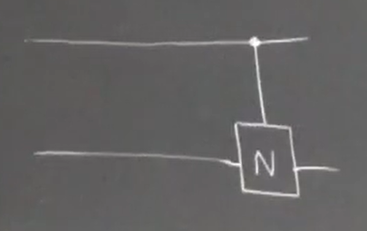
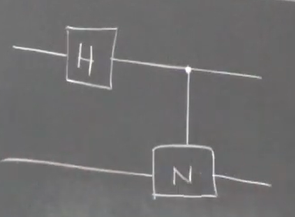

If there is one property that distinguishes quantum from classical, if there is one ability at the heart of quantum mechanics, it is **entanglement**. This is undescribable by classical mechanics. It also violates many more - concieved - laws of reality: local realism. It makes quantum mechanics non-local. Unreal, as some - with whom disagreeth I -say. 

Let me introduce a quantum gate at two qubits level, we'll build up from there. 

Take our NOT single qubit gate. It will act on some state $\ket\Psi$ to generate $\ket{\Psi'}$. I knwo the matrix for the NOT gate, $\begin{bmatrix}0&1\\1&0\end{bmatrix}$. Now the rows are $\ket0$ and $\ket1$ and the columns are $\bra0$ and $\bra1$. So we can write this NOT in Dirac notation as:
$$
\hat{U}_N = 0(\ket0\bra0) + 1(\ket0\bra1) + 1(\ket1\bra0) + 0(\ket1\bra1) \\
\hat{U}_N = \ket0\bra1 + \ket1\bra0
$$
This is the NOT gate in Dirac notation.

(Note that usually, when handwritten, the adjacent lines of $\bra{ }$ and .$\ket{ }$ are written more like a $\times$).

This is an **outer product**. An inner product ($\bra\alpha\ket\beta$), as seen before, is a scalar. So to recap it was:
$$
\ket{\alpha} = \begin{bmatrix}a\\b\end{bmatrix}, 
\ket{\beta} = \begin{bmatrix}c\\d\end{bmatrix} \\
\bra{\alpha} = \begin{bmatrix}a*&b*\end{bmatrix}\\
\bra\alpha\ket\beta = \begin{bmatrix}a^*&b^*\end{bmatrix}\begin{bmatrix}c\\d\end{bmatrix} = a^*c + b^*d
$$

So now, outer product:
$$
\ket0\bra1 = \begin{bmatrix}1\\0\end{bmatrix}\begin{bmatrix}0&1\end{bmatrix} = \begin{bmatrix}0&1\\0&0\end{bmatrix}
$$

This $1$ admist all zeros corresponds to the 1 in the same position in the matrix of a NOT gate: $\begin{bmatrix}0&1\\1&0\end{bmatrix}$. Likewise $\ket1\bra0$ would be $\begin{bmatrix}0&0\\1&0\end{bmatrix}$.

It's pretty simple but to implement this in Python it'd be something like:
```python
# from main.py
import numpy 
ket0 = numpy.array([[1],
                    [0]])
bra1 = numpy.array([[0, 1]])
outer_product = ket0 @ bra1
print(outer_product)
```

Now take our identity matrix, how'd it be written in Dirac:
$$
\hat{I} = \ket0\bra0 + \ket1\bra1
$$
Also:
$$
\hat{\sigma_y} = -i\ket0\bra1 + i\ket1\bra0
$$

NOTE: this is DIFFERENT FROM LINEAR ALGEBRA. I had said earlier that columns are kets, they aren't. 

This is useful.

I've said before, kets live in Hilbert space. And operators live inside Luoville space. 

Suppose I now define a 2-qubit gate. 


A controlled NOT gate. (C-NOT). Suppose both qubits are $\ket0$. The best way to differntiate is $\ket0_1$ and $\ket0_2$. Put a $\otimes$ between them. So we get: $\boxed{\ket0_1\otimes\ket0_2}$.

Sometimes you can get lazy and write the following:
$$
\ket0_1\otimes\ket0_2 = \ket0\otimes\ket0 = \ket0\ket0 = \ket{00}
$$
(the gradual devolution of mankind)

I will be using $\ket{\alpha\beta}$ just because it is easier. 

What does the LA for this look like?

We know the co-ordinates of $\ket0$. There are two co-ordinates, so the Hilbert space (right now) is spanned by two vectors of two dimension. Any vector, on the bloch sphere, can be written in terms of $\ket0$ and $\ket1$. But here there are two qubits. So space becomes bigger. So, to describe these two vectors, we need 4 dimensions. So we get a 4D Hilbert space. If there were three qubits, it becomes 8 dimensional. Why? Since we have two co-ordinates in our $\ket0$ and $\ket1$. Four? 16. $n$? $2^n$. The size grown exponentially. That is the beauty of quantum computing. With linear amount of resources, you can solve exponentially large problems. 

How do I show the tensor product in LA? Now I need a bigger column vector, with 4 entries instead of 2. It's simple:
$$
\ket{00} =
\begin{bmatrix} 1\\0 \end{bmatrix} \otimes \begin{bmatrix} 1\\0 \end{bmatrix} 
=
\begin{bmatrix} 1*1\\1*0\\0*1\\0*0 \end{bmatrix}
=
\begin{bmatrix} 1\\0\\0\\0 \end{bmatrix}
$$

---
From this we can generalise that
$$
\begin{bmatrix} a\\b \end{bmatrix} \otimes \begin{bmatrix} c\\d \end{bmatrix}
=
\begin{bmatrix} ac\\ad\\bc\\bd \end{bmatrix}
$$
---

The logical next block is $\ket{01}$. 
$$
\ket{01} =
\begin{bmatrix} 1\\0 \end{bmatrix} \otimes \begin{bmatrix} 0\\1 \end{bmatrix}
=
\begin{bmatrix} 0\\1\\0\\0 \end{bmatrix}
$$

Then, $\ket{10}$ will be
$$
\ket{10} =
\begin{bmatrix} 0\\1 \end{bmatrix} \otimes \begin{bmatrix} 1\\0 \end{bmatrix}
= 
\begin{bmatrix} 0\\0\\1\\0 \end{bmatrix}
$$

And $\ket{11}$ will be
$$
\ket{11} = 
\begin{bmatrix} 0\\1 \end{bmatrix} \otimes \begin{bmatrix} 0\\1 \end{bmatrix}
=
\begin{bmatrix} 0\\0\\0\\1 \end{bmatrix}
$$

All of these are orthogonal. 

So, in 4-dimensional space, any quantum state will be written as a superposition of these as
$$
\ket{\Psi} = C_{00}\ket{00} + C_{01}\ket{01} + C_{10}\ket{10} + C_{11}\ket{11}
$$
Or in vector notation
$$
\ket{\Psi} = C_{00}\ket{00} + C_{01}\ket{01} + C_{10}\ket{10} + C_{11}\ket{11} = 
\begin{bmatrix} C_{00}\\C_{01}\\C_{10}\\C_{11} \end{bmatrix}
\\
C_{00}, C_{01}, C_{10}, C_{11} \in \mathbb{C}
$$

To normalise, the sum of all of the mod-square of the coeffecients has to be 1.  
$$
|C_{00}|^2 + |C_{01}|^2 + |C_{10}|^2 + |C_{11}|^2 = 1
$$

If we have, say, 15 qubits. We can write something like:
$$
\otimes_{i=1}^{15} C_i\ket{\Phi_i} = C_1\ket{0000\dots0} + C_2\ket{0\dots1} + \dots C_{15}\ket{1\dots1}
$$

Suppose I have a unitary gate acting on two qubit state. How big should $\hat{U}$ be? 4x4, since our vectors have 4 dimensions. So with $n$ qubits, the Hilbert space - denoted by $\mathscr{H}$ - we'd have $2^n$ basis vectors. My beloved Bloch Sphere also breaks down in multi-qubit states. There is no nice way to represent a multi-qubit system. 

The size of the matrices - Liouville space $\mathscr{L}$ - is $2^n \times 2^n = 4^{n-1}$. So bigger and bigger matrices. For, say 2 qubits, you need $4^{2-1} = 4$ so a 4x4 matrix. Technically it should be $4^n$, since there are $4^n$ elements in it and $4^{n-1}\times4^{n-1}$ dimensions. 

Let's get back to the C-NOT gate. it's a genuine two qubit operation. I could've done a NOT gate on the first, and a NOT gate on the second, but that is not a true two-qubit operation. Uncorreletion. 

The C-NOT is a genuinine two-qubit operation. The truth table is as follows:
|input|output|
|----|----|
$\ket{00}$ | $\ket{00}$ (nothing changes)
$\ket{01}$ | $\ket{01}$ (nothing changes)
$\ket{10}$ | $\ket{11}$
$\ket{11}$ | $\ket{10}$

Matrix, you take the first basis state, and write its output in the first column, then the output of the second basis state in the second column, as so on. 
$$
\hat{U}_{C-NOT} = 
\begin{bmatrix}
1&0&0&0\\
0&1&0&0\\
0&0&0&1\\
0&0&1&0
\end{bmatrix}
$$

Now, the outer product? The mnemonic is the rows are kets, and the columns are bras.

It'd be:
$$
\boxed{
\ket{00}\bra{00} + \ket{01}\bra{01} + \ket{10}\bra{11} + \ket{11}\bra{10}
}
$$

As obvious, just pick the elements that are *not* zeros.  These all have a coefficient 1, the others do exist, just with a coefficient 0. 

Say, just because I can, I do this:
$$
\ket0\bra0 \otimes \hat{I} + \ket1\bra1 \otimes \hat\sigma_x
$$

---

$$
\begin{bmatrix}1\times n \text{ row vector}\end{bmatrix} 
\begin{bmatrix}n\\\times\\1\\\text{ column vector}\end{bmatrix} 
\implies
\bra{ }\ket{ } \quad \text{Inner Product}
$$
$$
\begin{bmatrix}n\\\times\\1\\\text{ column vector}\end{bmatrix} 
\begin{bmatrix}1\times n \text{ row vector}\end{bmatrix} 
\implies
\ket{ }\bra{ } \quad \text{Outer Product}
\implies
n\times n \text{ matrix}
$$
$$
\ket{01}\bra{11}
=
\begin{bmatrix}0\\1\\0\\0\end{bmatrix}
\begin{bmatrix}0&0&0&1\end{bmatrix}
=
\begin{bmatrix}
0&0&0&0\\
0&0&0&1\\
0&0&0&0\\
0&0&0&0
\end{bmatrix}
$$

So I am sampling...think of these as co-ordinates.

---

SO let
$$
\hat{X} = \ket0\bra0 \otimes \hat{I} + \ket1\bra1 \otimes \hat\sigma_x
$$

So, the outer product forms of $\hat{I}$ and $\hat\sigma_x$ are $(\ket0\bra0 + \ket1\bra1)$ and $(\ket0\bra1 + \ket1\bra0)$.
$$
\hat{X} = \ket0\bra0 \otimes (\ket0\bra0 + \ket1\bra1) + \ket1\bra1 \otimes (\ket0\bra1 + \ket1\bra0) 
$$

In matrix form,
$$
\begin{bmatrix}1&0\\0&0\end{bmatrix} \otimes \begin{bmatrix}1&0\\0&1\end{bmatrix} + \begin{bmatrix}0&0\\0&1\end{bmatrix} \otimes \begin{bmatrix}0&1\\1&0\end{bmatrix}
$$

Now, just multiply each entry in the matrix to the left of the $\otimes$ to the entire matrix to the left of the $\otimes$. So we get:
$$
\begin{bmatrix}1&0\\0&0\end{bmatrix} \otimes \begin{bmatrix}1&0\\0&1\end{bmatrix}
=
\begin{bmatrix}
1&0&0&0\\
0&1&0&0\\
0&0&0&0\\
0&0&0&0
\end{bmatrix}
$$
Likewise
$$
\begin{bmatrix}0&0\\0&1\end{bmatrix} \otimes \begin{bmatrix}0&1\\1&0\end{bmatrix}
=
\begin{bmatrix}
0&0&0&0\\
0&0&0&0\\
0&0&0&1\\
0&0&1&0
\end{bmatrix}
$$

Now, adding these matrices
$$
\hat{X} =
\begin{bmatrix}
1&0&0&0\\
0&1&0&0\\
0&0&0&0\\
0&0&0&0
\end{bmatrix}
+
\begin{bmatrix}
0&0&0&0\\
0&0&0&0\\
0&0&0&1\\
0&0&1&0
\end{bmatrix}
=
\begin{bmatrix}
1&0&0&0\\
0&1&0&0\\
0&0&0&1\\
0&0&1&0
\end{bmatrix}
=
\hat{U}_{C-NOT}
$$

So it is one way of writing the controlled NOT gate. One is this simplified, expanded form - $\ket{00}\bra{00} + \ket{01}\bra{01} + \ket{10}\bra{11} + \ket{11}\bra{10}$ - and the other is this more conceptual - $\ket0\bra0 \otimes \hat{I} + \ket1\bra1 \otimes \hat\sigma_x$.

This kind of outer product - of a state with itself - is called a **density matrix** (explained further later). So say I have a state $\ket\Psi$, I write $\bra\Psi$ making it $\ket\Psi\bra\Psi$ this is another way to represent the state. Just in higher dimensions. It is thus called the density matrix, given the symbol $\rho$ (Greek letter, rho). 

So what i do is, what if the first qubit is in $\ket0$, I write the density matrix corresponding to it - $\ket0\bra0$ - what happens to the second qubit? Nothing. Another way to say "nothing" is identity $\hat{I}$ operations. Essentialy $\times1$ in oridinary arithmetic or a waiting move in chess. Keep it as it is. Then I add the $+$ sign. If the second qubit is in $\ket1$, I do a NOT gate, which corresponds to the Pauli $\hat\sigma_x$. 

Conceptually, this is what the NOT gate is doing. If the first qubit is in the state $\ket0$, it does nothing to the second qubit. If the first qubit is in the state $\ket1$, it inverts the second qubit (by Pauli operator $\hat\sigma_x$). 

So now we have the facility to describe two-qubit operations. They are formed by putting together single qubit operations. Good thing is that you can have a controlled linkage between what happens to one qubit depending upon the state of the other. You can have controlled gates. Quantum computing is not intresting without these controlled and correlated gates. 

Say, now I extend my circuit. Now I put a Hadamard gate on the first qubit. So it becomes as follows.



We know H:
$$
\ket0 \mapsto \frac{\ket0 + \ket1}{\sqrt2}\\
\ket1 \mapsto \frac{\ket0 - \ket1}{\sqrt2}
$$

We know what a single Hadamard gate does:
$$
\hat{H} = 
\frac{1}{\sqrt2}\begin{bmatrix}1&1\\1&-1\end{bmatrix}
$$

The first qubit ALWAYS applies a Hadamard gate. What does it do to the second qubit? "nothing". So..
$$
\hat{U}_H = \hat{H} \otimes \hat{I}
$$

It is really a one-qubit gate, written a two-qubit circuit. 

And we know what C-NOT is:
$$
\hat{U}_{C-NOT} = \ket0\bra0 \otimes \hat{I} + \ket1\bra1 \otimes \hat\sigma_x
$$

Taking them together, we get
$$
\hat{U} = \hat{U}_{C-NOT} \hat{U}_H
$$

This is called an **entangler circuit**. What does it do to some unsuspecting qubits?

Take $\ket{00}$. Which is really just $\ket0\otimes\ket0$. What would be the state right after the Hadamard, and before the C-NOT? 
$$
\ket0\otimes\ket0 \mapsto^{\hat{U}_H} = \frac{1}{\sqrt2}(\ket0 + \ket1) \otimes \ket0
$$

Which is also
$$
\frac{1}{\sqrt2}(\ket{00} + \ket{10}) \otimes \ket0
$$

Behold! A superposition!

Now these aer separable. What happens to the first qubit, doesn't happen to the second qubit. Since $frac{1}{\sqrt2}(\ket0 + \ket1) \otimes \ket0$ and $\frac{1}{\sqrt2}(\ket{00} + \ket{10}) \otimes \ket0$ are the different ways to write the same physical state. 

$$
\frac{1}{\sqrt2}(\ket{00} + \ket{10}) \mapsto^{\hat{U}_{C-NOT}}
\boxed{
    \frac{1}{\sqrt2} (\ket{00} + \ket{11})
}
$$

This, too, is a superosition. 

Is it separable? No. I cannot do something on the first qubit and it **not** be done on the second.
$$
\ket\Psi\otimes\ket\Phi \neq \frac{1}{\sqrt2} (\ket{00} + \ket{11})
$$

This is an **entangled state**. It is not a separable state. It cannot be factored out into a distinct state of the first-qubit and a distinct state of the second-qubit. This is, in fact, one of the example of one of the four **Bell states**. There are three more of such non-separable states in two-qubit space. 

This is a pure breed, genuine, two-qubit state. 

Say I have three qubits. A NOT gate at the third qubit. This is called a **Toffli gate**.

The four Bell states are:
$$
\ket{\Phi^+} = \frac{1}{\sqrt2}(\ket{00} + \ket{11})
$$
$$
\ket{\Phi^-} = \frac{1}{\sqrt2}(\ket{00} - \ket{11})
$$
$$
\ket{\Psi^+} = \frac{1}{\sqrt2}(\ket{01} + \ket{10})
$$
$$
\ket{\Psi^-} = \frac{1}{\sqrt2}(\ket{01} - \ket{10})
$$

Or simply,
$$
\ket{\Phi^\pm} = \frac{1}{\sqrt2}(\ket{00} \pm \ket{11})
$$
$$
\ket{\Psi^\pm} = \frac{1}{\sqrt2}(\ket{01} \pm \ket{10})
$$

(these are maximally entanglemd)

Say my state $\ket\chi$.
$$
\ket\chi = \frac{1}{\sqrt2}(\ket{01} - \ket{10}) = -\frac{1}{\sqrt2}(\ket{10} - \ket{01})
$$


How do I un-entangle these? Hadamard and CNOT are self-inverse. So you place them in reverse order. 
$$
\hat{U}_{H} \hat{U}_{CNOT}\hat{U}_{CNOT}\hat{U}_{H} = \hat{I}
$$

I can use this to measure this state. Say I input $\frac{1}{\sqrt2}(\ket{00} + \ket{11})$ into a N->H. What state do I get between the N and the H?

$$
\frac{1}{\sqrt2}(\ket{00} + \ket{11}) \mapsto^{CNOT} \frac{1}{\sqrt2}(\ket{00} + \ket{10}) \\
= \frac{1}{\sqrt2}(\ket0 + \ket1) \otimes \ket0 \\
{}^H\longmapsto \ket0 \otimes \ket0 \\
= \ket{00}
$$

Looking at this, you cannot ascribe a state to either qubit. It is IMPOSSIBLE to identify what state the first qubit is in, and what state the second qubit is in. 

For three qubits, the maximally entangled state is:
$$
\frac{1}{\sqrt2}(\ket{000} + \ket{111})
$$
This is called the **Greenberger–Horne–Zeilinger State** (GHZ state).

Is the following state perfectly entangled? no. it is partially entangled. 
$$
\frac{1}{\sqrt2}(\ket{000} + \ket{011}) = \ket{0} \otimes \frac{1}{\sqrt2}(\ket{00} + \ket{11})
$$

But say I have this.
$$
\frac{1}{\sqrt2}(\ket{000} + \ket{101})
$$

This is a bit tricky but
$$
\frac{1}{\sqrt2}\Big(
    \ket{00}_{1,3} + \ket{11}_{1,3}
    \Big) \otimes \ket{0}_{2}
$$

As it approches 3, 4 qubits, the idea of entanglement becomes a big blurry. There could be different kinds of entanglement. It is easier to define in two qubits. 

Let's go back to the beamsplitter. Say I input $\frac{1}{\sqrt2}(\ket{00} + \ket{11})$. I put a beamsplitter on path of one qubit, but I don't care about the other. For all I care, it goes in the trash can. 

What're the probabilities that either detector will click? 50/50. In information theory terms, the entropy is maximum. Totally random. Say this is Alice (standard terminology now). There are detectors $A$ and $A'$. So $P(A) = P(A') = \frac12$.

Now say Bob. Does this in another part of the universe. He lets qubit A go to the trash can. Measures $B$ and $B'$. $P(B) = P(B') = \frac12$. 

"My qubits are trash!", both might say, "there is no order". Which is correct. But say Alice and Bob conduct these at the same time. 

What will happen is, when Alice's detector A clicks, Bob's detector B clicks. When A', B'. 

We can't be clever and share our results while experimenting. The speed of light is our limit. 

Say these states were different. We'd get perfect anti-correlation. 


