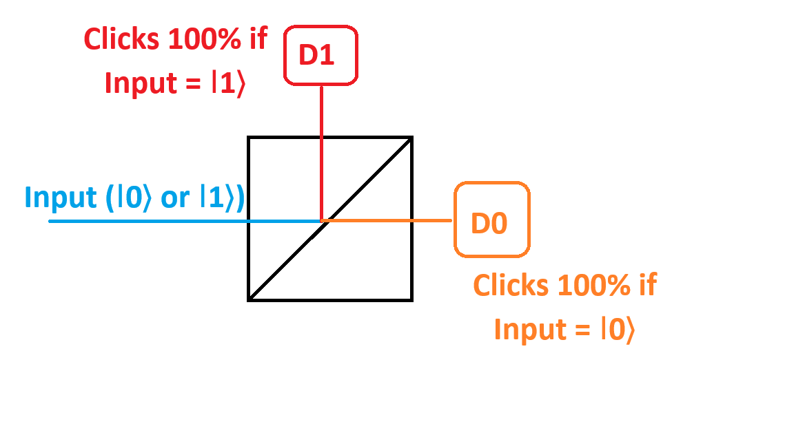

Quantum information has a certain special property: it cannot be copied.

This is known as the **No-cloning Theorem**. It states that: _if you have a quantum state $\ket\Psi$ and you want to create another state **exactly** like this, you cannot_. So, we can say the following

$$
\ket\Psi \otimes \ket0 \not\longmapsto \ket\Psi \otimes \ket\Psi
$$

(note: $\ket0$ is used as an example.)

It is closely associated with our inability to measure a state accurately.

Say I gain a supernatural power to measure any state perfectly. Then I would be able to measure a state perfectly, and then perform a transformation on another state to make it into that state.

Every qubit lives on/within the Bloch Sphere. If you're able to measure the angles $\theta$ and $\phi$ perfectly, you can measure the state (say, $\ket\Psi$). You can measure what the state is _in one go_. Then you can take another state (say, $\ket0$), and do a transformation to convert the other state to the state ($\ket\Psi$).

Since we cannot measure arbitrary quantum states, it is not possible to clone quantum states.

Let's prove it. It is quite simple.

Say I have a $\ket\Psi$ such that

$$
\ket\Psi = \alpha\ket0 + \beta\ket1 \\
\alpha,\beta \in \mathbb{C} \\
|\alpha|^2 + |\beta|^2 = 1
$$

Now you want to copy this state. Copying has to be done in a manner that preserves the original state as well.

The proposition is that I can take the arbitrary quantum state ($\ket\Psi$) and perform a transformation (say $\hat{U}_c$) to convert another quantum state ($\ket0$, for instance) to the original state ($\ket\Psi$).

$$
\ket\Psi \otimes \ket0 \xmapsto{\hat{U}_c} \ket\Psi \otimes \ket\Psi
$$

Now I have to show that such a unitary transformation ($\hat{U}_c$) does not exist.

---

Now there is an operation that **is** possible called **Swapping**. Loosely, it looks like such

$$
\ket\Psi \otimes \ket\Phi \xmapsto{\hat{U}_s} \ket\Phi \otimes \ket\Psi
$$

---

Suppose such a transformation exists. Then the following should be true:

$$
\ket\Psi \otimes \ket0 \xmapsto{\hat{U}_c} \ket\Psi \otimes \ket\Psi \\
\ket\Psi \otimes \ket\Psi = (\alpha\ket0 + \beta\ket1) \otimes (\alpha\ket0 + \beta\ket1) \\
= \alpha^2\ket{00} + \alpha\beta\ket{01} + \alpha\beta\ket{10} + \beta^2\ket{11}
$$

Suppose I also expand the states before the transformation.

$$
\ket\Psi \otimes \ket0 = (\alpha\ket0 + \beta\ket1) \otimes \ket0 \\
= \alpha\ket0\ket0 + \beta\ket1\ket0
$$

Therefore

$$
\alpha\ket0\ket0 + \beta\ket1\ket0 \xmapsto{\hat{U}_c} \alpha\ket{00} +\beta\ket{11}
$$

Are the states $\alpha\ket{00} +\beta\ket{11}$ and $\alpha^2\ket{00} + \alpha\beta\ket{01} + \alpha\beta\ket{10} + \beta^2\ket{11}$ the same state?

They are absolutely different! Therefore, such a unitary transformation does not exist. If quantum mechanics as well as unitary transformation are linear - which they are - cloning is not possible. It is only possible when either $\alpha = 0$ or $\beta = 0$. You can come up with a transformation that clones orthogonal states. So

$$
\text{Both} \ket0\ket0 \xmapsto{U_c} \ket0\ket0 \text{ and } \ket1\ket0 \xmapsto{U_c} \ket1\ket1 \text{ are possible.}
$$

So you can build operations to convert basis states into each other. But not arbitrary quantum states.

In other words, you cannot make a measurement that distinguishes between two orthogonal states.

Going back to our archetypical beamsplitter, if I am SURELY given that my input state is either of $\ket0$ or $\ket1$, then I can determine with absolute certainty what detector would click.



However, if the `Input` where an arbitrary quantum state -- $\alpha\ket0 + \beta\ket1$ -- I'd never be able to tell what the quantum state is. Which means I would never be able to measure it. Which means I would never be able to determine what $\alpha$ and $\beta$ are, for, that is what measurement entails.

$$
\text{I can not clone quantum information} \\
\Updownarrow \\
\text{I can not discriminate between two non-orthogonal states with 100\% accuracy}
$$

---

So what the second statement "$\text{I can not discriminate between two non-orthogonal states with 100\% accuracy}$" means is:

Say I have a chef who makes quantum states. He gives me two states $\ket0$ and $\frac{1}{\sqrt2}(\ket0 + \ket1)$. Will I, the measurer, be able to the audience - in one go - whether the input state is $\ket0$ or $\frac{1}{\sqrt2}(\ket0 + \ket1)$? No, for, the states are non-orthogonal.

So if your input states are ONLY orthogonal states, then, yes, you can design a unitary operation to clone those states.

---

Now, important note is, NONE of the math I just showed has any measurement. All of this precedes measurement. So when you $\text{discriminate}$, you're making a measurement. When you $\text{clone}$, you don't make a measurement.

A unitary matrix that does this $\ket0\ket0 \xmapsto{U_c} \ket0\ket0$ and $\ket1\ket0 \xmapsto{U_c} \ket1\ket1$ is the CNOT gate from [Lecture 5](../Lecture%205/README.md).

If you're building a universal quantum computer, you make it such that it works regardless of what the input state is. If you're working in a subspace, then you can ignore what happens to the other states and only work with specific states.

This is another reason for the disproof of the No-Cloning theorem, since to make a proper quantum computer, you need it to work properly regardless of the input. And we can only clone the orthogonal states.

Now let's look at an algorithm: **Quantum teleportation**. Note that this is a bit that usually unis don't teach this as the first algorithm, but I can, so why not.

The idea is that you take an arbitrary state $\ket\Psi$ at a location, say Alice, and trasmits it some other location, say Bob. Keeping in account the obvious, they are gazillions of light years apart.

One thing is, Alice measures $\ket\Psi$, snitches to Bob about the state, Bob takes a raw qubit and transforms it. But the problem is, you cannot measure $\ket\Psi$. Because remember these wise words: "If you're building a universal quantum computer, you make it such that it works regardless of what the input state is. If you're working in a subspace, then you can ignore what happens to the other states and only work with specific states".

"Transmits" is a bit of a problamatic word here, so a new word is coined - **$\text{Teleportation}$**.

This is **not** cloning, the intiial state (Alice's) is destroyed.

So Alice gets a qubit - spin, electron, spin, some matter - in state $\ket\Psi$. Now, what she wants to do is not measure the quantum state. If she does, she'll never know what the state was unless she has multiple copies of $\ket\Psi$ and then build the statistics and then infer the probablity amplitudes. Say I have a number $0.5$, the probablity amplitude is not simply $\sqrt{0.5}$, there's a phase factor. If we're dealing with a pure state and we wish to measure it, we have $\theta$ and $\phi$. there are more for mixed states. We don't have infinite supplies of this.

So we have the concept of the scratch qubit here. The auxillary qubits that assist in algorithms are called **ancillory qubits**. This was used in the example: $\ket\Psi\ket0 \xmapsto{U_c} \ket\Psi\ket\Psi$. Here $\ket0$ is the scratch qubit.

So we need ancillory qubits to assist with the teleportation here. We prepare a pair of entangled qubits. One goes to Alice and the other goes to Bob. So now we have three particles. One: the one that bears the original quantum state, which Alice has. Alice also has another particle, a part of an entangled pair. An entangler, some machine, is preparing entangled particles. Suppose this entangler is preparing this Bell state $\frac{1}{\sqrt2}(\ket{00} + \ket{11})$. Let's call these:

- Qubit 1: the original bearer (Alice has this)
- Qubit 2: the part of the entangled pair with Alice
- Qubit 3: the part of the entangled pair with Bob

So qubit 1 is the arbitrary state $\alpha\ket0 + \beta\ket1$. 2nd qubit is the $\ket0\otimes\ket1$ and 3rd is the $\ket0\otimes\ket1$ both of which come from $\frac{1}{\sqrt2}(\ket{00} + \ket{11})$.

Now, as one does, she does a unitary transformation on the qubits in her possession. Something like this:

```
Qubit 1 ------ * ----- [H] ----
               |
Qubit 2 ------[N] --------------

(A controlled NOT gate)
```

Initally our state is:

$$
\ket\Psi \otimes \frac{1}{\sqrt2}(\ket{00} + \ket{11})
$$

I can rewrite this as

$$
\frac{1}{\sqrt2}(\alpha\ket0 + \beta\ket1) \otimes (\ket{00} + \ket{11})
$$

Now if I do a CNOT on 1 and 2:

$$
\xmapsto{\hat{U}_{CN 1-2}} \frac{1}{\sqrt2} (\alpha\ket{000}
                                            + \alpha\ket{011}
                                            + \beta\ket{110}
                                            + \beta\ket{101})
$$

---

The third qubit, to remind myself, is this:

```
(∣00⟩+∣11⟩)
   ^    ^
```

---

A step I skipped in the middle was this:

$$
\frac{1}{\sqrt2} (\alpha\ket{000}
                  + \alpha\ket{011}
                  + \beta\ket{100}
                  + \beta\ket{111})
$$

CNOT between these:

```
(α∣000⟩+α∣011⟩+β∣100⟩+β∣111⟩)
   ^^     ^^     ^^     ^^
   ||     ||     ||     ||
   12     12     12     12
```

How it goes is: if first qubit is $\ket1$, invert the second. So following that:

- $\alpha\ket{000}$ has first qubit in 0, so remains unchanged
- $\alpha\ket{011}$ has first qubit in 0, so reamins unchanged
- $\beta\ket{100}$ has first qubit in 1, so becomes $\ket{110}$
- $\beta\ket{111}$ has first qubit in 1, so becomes $\ket{101}$

Now I wanna do a Hadammard gate on the first qubit.

$$
\frac{1}{\sqrt2} (\alpha\ket{000}
                    + \alpha\ket{011}
                    + \beta\ket{110}
                    + \beta\ket{101})
                    \quad
                    \text{(CNOT output)}
$$

$$
\xmapsto{\hat{U}_{H1}}
\frac12 \Big[
            \alpha (\ket{0} + \ket{1})\ket{00}
            + \alpha (\ket{0} + \ket{1})\ket{11}
            + \beta (\ket{0} - \ket{1})\ket{10}
            + \beta (\ket{0} - \ket{1})\ket{01}
\Big]
$$

Expanding it out we get:

$$
\frac12 \Big[
            \alpha \ket{000} + \alpha\ket{100}
            + \alpha \ket{011} + \alpha\ket{111}
            + \beta \ket{010} - \beta\ket{110}
            + \beta \ket{001} - \beta\ket{101}
\Big]
$$

Now consider the two boxed state where the first two qubit is in the state $\ket{00}$:

$$
\boxed{\alpha \ket{000}} + \alpha\ket{100}
            + \alpha \ket{011} + \alpha\ket{111}
            + \beta \ket{010} - \beta\ket{110}
            \boxed{+ \beta \ket{001}} - \beta\ket{101}
$$

Factor out the common $\ket{00}$

$$
\begin{equation}
\frac12 \Big[\ket{00} \otimes \{\alpha\ket0 + \beta\ket1\} \Big]
\end{equation}
$$

Now consider these boxed states:

$$
\alpha \ket{000} \boxed{+ \alpha\ket{100}}
            + \alpha \ket{011} + \alpha\ket{111}
            + \beta \ket{010} - \beta\ket{110}
            + \beta \ket{001} \boxed{- \beta\ket{101}}
$$

Now take common the $\ket{10}$,

$$
\begin{equation}
\frac12 \Big[\ket{10} \otimes \{\alpha\ket0 - \beta\ket1\} \Big]
\end{equation}
$$

Now consider these:

$$
\alpha \ket{000} + \alpha\ket{100}
            \boxed{+ \alpha \ket{011}} + \alpha\ket{111}
            \boxed{+ \beta \ket{010}} - \beta\ket{110}
            + \beta \ket{001} - \beta\ket{101}
$$

Take common the $\ket{01}$

$$
\begin{equation}
\frac12 \Big[\ket{01} \otimes \{\alpha\ket1 + \beta\ket0\} \Big]
\end{equation}
$$

Finally consider the remaining two states, and take common the $\ket{11}$.

$$
\begin{equation}
\frac12 \Big[\ket{11} \otimes \{\alpha\ket1 - \beta\ket0\} \Big]
\end{equation}
$$

Combining $(1)$, $(2)$, $(3)$ and $(4)$, we get:

$$
\frac12 \Big[\ket{00} \otimes \{\alpha\ket0 + \beta\ket1\} \Big]
+ \frac12 \Big[\ket{10} \otimes \{\alpha\ket0 - \beta\ket1\} \Big]
+ \frac12 \Big[\ket{01} \otimes \{\alpha\ket1 + \beta\ket0\} \Big]
+ \frac12 \Big[\ket{11} \otimes \{\alpha\ket1 - \beta\ket0\} \Big]
$$

Simplifying,

$$
\ket{\Psi'} =
\frac12 \Big[\ket{00} \otimes \{\alpha\ket0 + \beta\ket1\}
+ \ket{10} \otimes \{\alpha\ket0 - \beta\ket1\}
+ \ket{01} \otimes \{\alpha\ket1 + \beta\ket0\}
+ \ket{11} \otimes \{\alpha\ket1 - \beta\ket0\}\Big]
$$

This is the state right here:

```
Qubit 1 ------ * ----- [H] ----- <--|
               |                    |
Qubit 2 ------[N] -------------- <--|
                                    |
Qubit 3 ------------------------ <--|
                                    |
                                 Right here, call it ∣Ψ_1⟩
```

Now how measurement is done is we put beamsplitters able to distinguish $\ket0$ from $\ket1$. So something like:

```
                                [D1]
                                 |
                                ∣1⟩
                                 |
Qubit 1 ------ * ----- [H] -----[BS]--∣0⟩ --- [D0]
               |
               |                [D1]
               |                 |
               |                ∣1⟩
               |                 |
Qubit 2 ------[N] --------------[BS]--∣0⟩ --- [D0]

Qubit 3 ------------------------

```

So she can only get 4 possible outputs: `D0,D0`, `D0,D1`, `D1,D0`, `D1,D1`. So $00$, $01$, $10$, $11$. Let's label them $0$, $1$, $2$, $3$. So:

```
00, 01, 10, 11 <=> 0, 1, 2, 3
^^
||
12
```

What is $P(0)$? $\frac14$, right? Which is just the mod-square of the coefficient $\frac12$. So,
$P(0) = P(1) = P(2) = P(3) = \frac14$

We can even go so far as to say

$$
P(\ket{00} \otimes \{\alpha\ket0 + \beta\ket1\}) = P(\ket{10} \otimes \{\alpha\ket0 - \beta\ket1\}) = P(\ket{01} \otimes \{\alpha\ket1 + \beta\ket0\}) = P(\ket{11} \otimes \{\alpha\ket1 - \beta\ket0\}) = \frac14
$$

(restating simply based on the quantum states of $\ket{\Psi'}$)

Alice's output is a 2-clasical-bit string. So this is her message to Bob. She sends this string to Bob (maybe call, email, shout, telepathy, classical channel - that is important). Call this $M_A$ from message-Alice.

So the common factors we took are the detectors of Alice and the rest of it (in the { }s) are Bob's.

---

Remember how this arrangement was the entangler:

```
----[H]----*---
           |
----------[N]---
```

(eg. Input: $\ket{00}$. Output: $\frac{1}{\sqrt2}(\ket{00} + \ket{11})$ )

So the reverse of it is the de-entangler:

```
------*-----[H]----
      |
-----[N]------------
```

(eg. Input: $\frac{1}{\sqrt2}(\ket{00} + \ket{11})$. Output: $\ket{00}$)

The de-entangler is called the Bell State measurement operation.

Say now Alice and Bob are required by the Geneva convention that whatever state Alice measures, Bob will make his qubit into it.

So say Alice sends that she has `00`. Bob has nothing to do. His corresponding qubit is $\alpha\ket0 + \beta\ket1$ which was the original state $\ket\Psi$ which ought to be teleported.

Now suppose Alice sends that she has `01`, so Bob's state is $\alpha\ket1 + \beta\ket0$. So now what does Bob have to do? a NOT gate (or really a Pauli $\hat\sigma_x$ gate).

Let's build a table from these.

| $\hat{U}_{BOB}$                                   | $M_A$ | Bob State, given Alice's state | Circuit        |
| ------------------------------------------------- | ----- | ------------------------------ | -------------- |
| $\hat{I}$ (Do nothing)                            | 00    | $\alpha\ket0 + \beta\ket1$     | `-----`        |
| NOT Gate = $\hat\sigma_x$                         | 01    | $\alpha\ket1 + \beta\ket0$     | `--[N]--`      |
| Phase by $\pi$ = $\hat\sigma_z$                   | 10    | $\alpha\ket0 - \beta\ket1$     | `--[π]--`      |
| NOT, then phase by $\pi$ $\propto$ $\hat\sigma_y$ | 11    | $\alpha\ket1 - \beta\ket0$     | `--[N]--[π]--` |

This implies, **teleportation is not instant**. You cannot exceed the speed of light. Because Alice to Bob the $M_A$ goes at speed of light since it is classical information. Contrary to pop science, super-luminous communication is not possible. 

How is no-coloning not violated here? The original state is destroyed.

Bob knows that after the necessery transformations, his qubit is gonna be an exact same of the original state. 

The information travels in 2cbit (classical bit) and the shared pair of entangled bits is ancillory and crucial for teleportaion. Entanglement bits are called ebits and counted by pair. so here we used 1 ebit.  