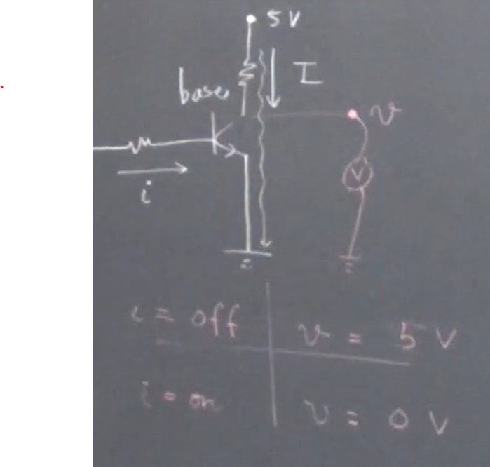
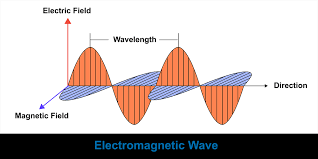
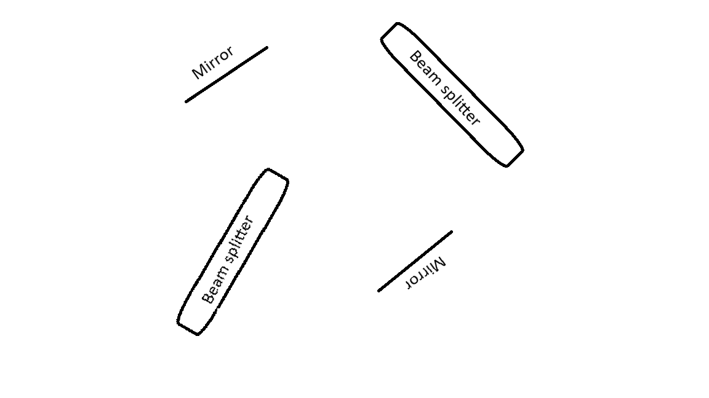
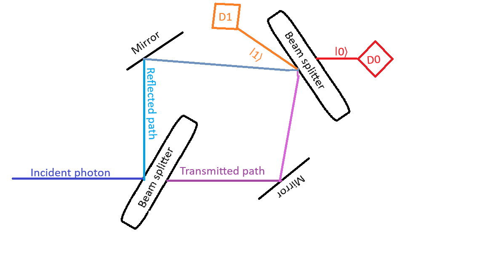
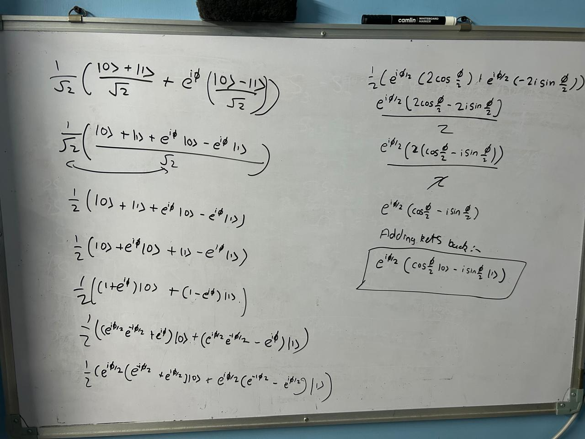
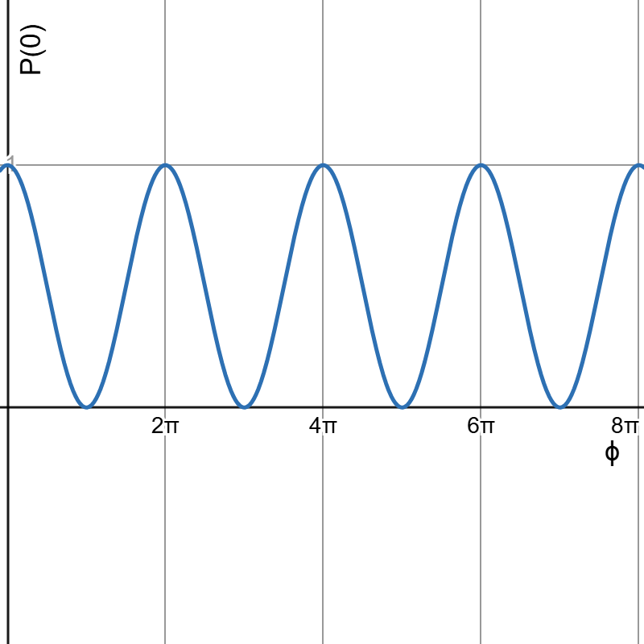
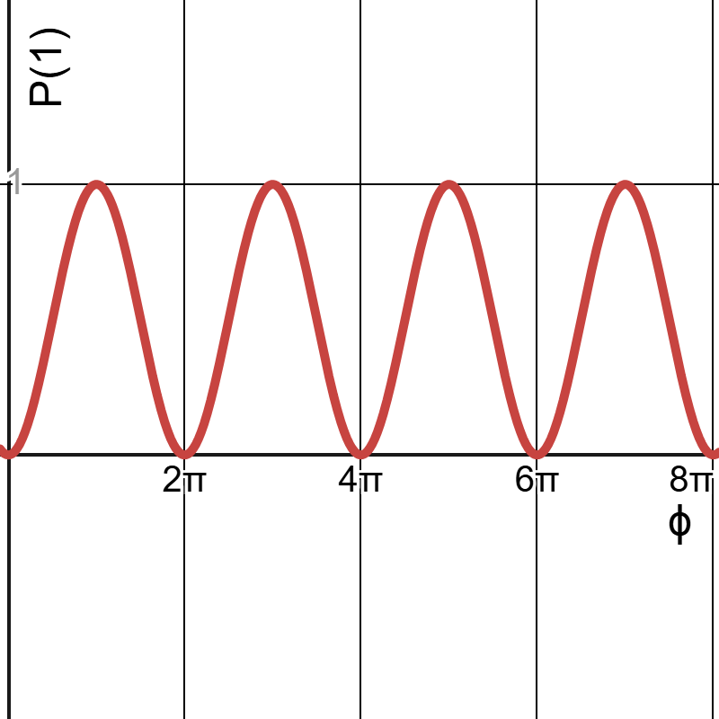
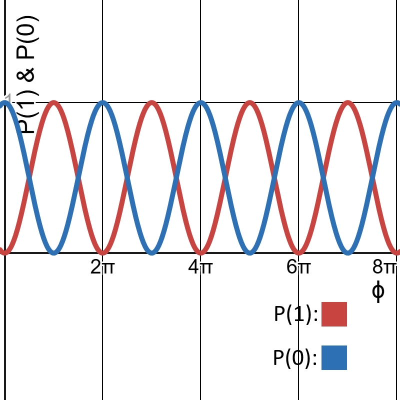
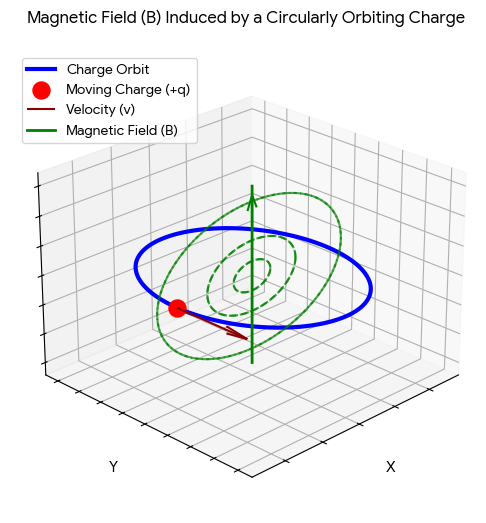

# Quantum Information Science and Technology

We are at the cusp of a second revolution (as far as many experts are concerned). First was at the beginning of the 20th century by Max, Erwin, Weber - and sometimes Albert, who laid the foundations of quanta. Now - in 2026 - we're at the cusp of a second revolution. Because of the new paradigms and development in Quantum Computing and technology. The 2022 and 2025 Nobel Prizes in Physics were given to Quantum Information Science and Technology. This is a preamble.

A big part of the pre-requisites of QM and modern physics would be explained as this proceeds.

# Lecture 1

#### Quantum States

Say I have an NPN transistor. Whenever there is a small current $\vec{i}$ coming into the base of this transistor. So whenver this current comes, a larger current $\vec{I}$ can flow through the actual transistor. This is basic working of a transistor. If you were to put a voltage measure near the $IN$ of the transistor, what would you see? If it's OFF, the voltage observed would be the voltage $v$ of the battery (say, 5V) since there is no current. If it (transistor) is ON, the voltage drop should occur across the resistor and the voltage does pass through the circuit so there is no voltage to measure there (assume that a resistor _is_ placed on the battery to the IN of the transistor). Let's call these states 1 and 0 respectively. So we can say
| $\vec{i}$ | $v$ | State
| ---- | ----| ---- |
| OFF | 5V | 1 |
| ON | 0V | 0 |

The circuit is as follows:


So we can say the transistor exists in a state 0 or 1. This is a classical device. If this were a quantum object, then we may also come up with ideas analigous to this.

Say this were a quantum transistor. It would also exist in these two states. This is binary logic -- ie. this has only two configurations. But in the quantum realm we have a habit to use **kets**. So $\ket{0}$ and $\ket{1}$. I have called these 0 and 1. But someone might call this $\ket{\alpha}$ and $\ket{\beta}$. But the main idea is that these are two distinct states.

###### A few more examples

######## Polarisation of a photon

Say, what is light?

- Electromagnetic radiation/waves/fields
- Packets of energy aka Photons

So there are two views of light. One is a wave, another is a packet.

Say I have a special camera that captures a wave frozen in time. There would be something oscillating. That thing is the _electric field_. This is what Newton and many other scientists dealt with.


But there is one more, equally strong view. The packet, Photon. They also have the energy.

For this sinusoidal wave we might even write an equation like $A\cos(kx + \omega{t} + \phi)$ (not too important, a simple Google search away).

And we also know what Time Period, Wavelength and Amplitude (here, the energy). And we know $f_{spatial} = \frac1\lambda$ and $f_{time} = \frac1T$. Now, this was Einstein and Plank's genius that "\*if the packet carries the frequency $f$, so its energy is $h f$, where $h \approx 6.63E-34 \text{ }m^2kg/s$.

Now in the equation $A\cos(kx + \omega t + \phi)$, if we change the $t$, we would see different positions of the wave at different times.

Also, the photon and the wave are the same just different representations of the same thing.

Now, is this the _only_ direction that the electric field could orient itself?

Now, the orientiation would be the polarisation in the photon and the motion of the wave in the wave.

Say the horizontal orientation is $\ket{0}$ and vertical $\ket{1}$. Also can use $\ket{H}$ and $\ket{V}$.

Suppose I have a 1mW laser with the wavelength of 500nm, I could compute the energy the photons as $E = hf$ and the number of photons as $n = \frac{P}{hf}$ . Which would be huge.

If somehow I were to reduce the number of photons, it would be a quantum object. It'd have these two distinct polarisations, which are **orthogonal** (if a photon is horizontally polarised, it can't be vertically polarised, and vice versa).

So this polarisation of the photon is one **example of a quantum state**.

And these could be _any other property_ of the photon.

######## Path of a photon

Suppose I have a device called beamsplitter. What it does is, when light shines on it, half (ideally) of it is reflected and half (ideally) of it is passed.

Now if I were to repeat this with one photon coming in. There is 50-50 probability of transmit (pass) and reflect.

- Just like the [polarisation](##polarisation-of-a-photon), this path of a photon is also a **degree of freedom** which is thesaurus for a measurable distinct property.

Let's call the transmission $\ket{0}$ and the reflection $\ket{1}$.

This path of a photon is also an **example of a quantum state**.

######## Spin of an electron

An electron has some mass and charge. It also has a _spin_. It doesn't literally spin, but it is a term scientists came up with.

A magnet has some north and south poles - two polar vectors. You can show a magnet with an arrow, a _magnetic dipole_.

An electron, too, is a very tiny - and unbelievably tiny - magnetic dipole. It is said to be the smallest magnetic movement - the Bohr magneton.

If I have an electron in a magentic field, the Least Action principle would have it be that the electon points in the direction parallel to that of the magnetic field. Let's call this electron field $\vec{\mu}$ and the magnetic field $\vec{B}$. This is one configuration $\ket{0}$ of this electric field.

Another possibility is that, for some reason - perhaps some radiation or anything of that sort - this electron points in the opposite direction. Call that $\ket{1}$.

Of course, the energies are different. $\ket{0}$ is low energy while $\ket{1}$ is high energy.

This spin of electron is also an **example of a quantum state**.

######## Computers

If we have a quantum register, each bit would be a quantum object.

We'd have 8 units, each in a certain quantum state. Say the normal register is `[0,0,1,1,0,1,1,0]` (54 in binary, but not important). The quantum register might be $\{\ket{0}, \ket{0}, \ket{1}, \ket{1}, \ket{0}, \ket{1}, \ket{1}, \ket{0}\}$. This would be something like 8 electrons (or ions, or photons) that somehow don't interact with each other.

Now it would be that each of those bits, is a quantum bit. Again, a **qu**antum **bit**. A **Qubit**. It is a two level system, where we can define the two states - $\ket{0}$ and $\ket{1}$. This is two dimensional - 0 and 1. These can be $n$-dimensional.

###### Is the world classical or Quantum?

The world we live in may seem classical. But it is actually quantum. Classical mechanics is a subset of quantum mechanics.

We don't see them because we're huge. The average behaviour of quantum particles looks to us as classical.

Our computers, too, work on the electrons and transistors which are millions in number. But if we had just one of each, the quantum behaviour would manifest.

#### Superposition

When dealing with quantum states, we use the Greek letter Psi ($\Psi$ or $\psi$). Since it is a quantum state, we put it in kets so we get $\ket{\Psi}$. These kets are from kets and bras notation by Paul Dirac. So it is called **Dirac's bra and ket notation**.

So $\ket{\Psi}$ is used to denote quantum state. For a qubit it might be $\ket{0}$ and $\ket{1}$ (at two levels).

If we go back to our transistor example. Either it is ON or it is OFF. They are mutually exclusive. In a classical world, say standing, I can either stand on the ground or on a chair. Not half way, assuming of course I don't want to fall. But quantum objects don't have that. Quantum objects can be in superpositions.

Meaning, the quantum state need not be $\ket{0}$ OR $\ket{1}$. It could really be some superposition of 0 and 1. For instance

$$
\ket{\Psi} = c_0\ket{0} + c_1\ket{1}
$$

where $c_0, c_1 \in \mathbb{C}$. Yes, they are complex, it is due to Descartes that we call $i$ _imaginary_, if he had known the significance they'd likely be something like _rotational numbers_. But that is a different topic.

A quantum object can be a superposition of 0 and 1 at **the same time**.

Other than being complex, the coefficients would need to have more properties but they have to do with probability so I'll deal with them later. So that is the most general way to write a qubit. Observation also changes this superposition, but that too is a topic for later.

One example might be $c_0 = 0, c_1 = 1$, you get $\ket{1}$ to be your state _for sure_. You change $c_0 = 1, c_1 = 0$, you get $\ket{1}$ to be your state _for sure_.

Suppose, $c_0, c_1 = \frac{1}{\sqrt{2}}$. This is a more exciting and intresting example than simple 0/1. Then my superposition becomes

$$
\ket{\Psi} = \frac{\ket{0}}{\sqrt{2}} + \frac{\ket{1}}{\sqrt{2}}
$$

This is a **superposition**.

One more exciting example might be $c_0 = \sqrt{\frac13}$ and $c_1 = \sqrt{\frac23}e^{i\frac\pi{3}}$. Both of these are complex numbers. Then my quantum state becomes

$$
\ket{\Psi} = \frac{1}{\sqrt{3}}\ket{0} +  \sqrt{\frac23}e^{i\frac\pi{3}}\ket{1}
$$

Let's go back to the [path of a photon](##path-of-a-photon). If I send a single photon in an ideal beam splitter, there is $\ket{0}$ that it transmits and $\ket{1}$ that it reflects.

I want to measure this. Note that every word in quantum mechanics - measure, superposition, state, is - have a lot of philosophy behind them, not you ideal dictionary definition **sometimes**.

To measure, I'll place a detector. What it does is _click_ when a photon passes through it. I'll place two - one on $\ket{0}$ and one on $\ket{1}$. Call them $D_0$ and $D_1$ respectively. These are not theoretical as they were when in 20th Century they were imagined, they are common nowadays in labs. Our eyes, while are good, can detect at minimum 40-50 photons (maybe, I'm not an optician). Some animals living in the deep ocean _might_ have eyes that detect single photons or a couple of photons.

In an ideal beamsplitter, the probability of either detectors clicking is 50/50.

Say I have following setup:


(excuse the bit of crooked drawing)

The mirrors and the beamsplitters are ideal in this case, so the mirrors _perfectly always_ reflect _every_ photon.

Suppose a photon is incident on the left beamsplitter. There is a 50% chance that it is reflected and a 50% chance that it is transmitted.

Then it goes to mirror (right if transmitted, left if reflected) and from (both) paths it goes into the second beamsplitter. Assume I keep a detector $D_0$ on the transmitted path of the second beamsplitter and $D_1$ on the reflected path thereof.

This special arrangement is called a **Mark-Zehndar Interfrometer**.


(ignore some crooked angles)

What is $P(D_0)$ and $P(D_1)$? There is 50-50 probability of each route. There are actually four 25-25-25-25 because there are 4 paths where the probability enters, but they add up to 50-50 or half-half.

But this doesn't happen in reality. This will be much more in detail in the next one.

## Lecture 2

(continuing from the Mark-Zehnder Interferometer)


A photon can't be split, under normal physcis.

In order to find probabilities, we repeat experiment multiple times. If we want a-priori probabilities, then QM can acertain you what the probabilites are.

Jsut like logic gates, when you input something through a beamsplitter, it can give these outputs

$$
\ket{0} \xmapsto{BS} \frac{\ket{0} + \ket{1}}{\sqrt{2}}
$$

Say a NOT gate, you don't just describe what it does to a single input. You have to describe what it does to an orthogonal input too. Similarly, the beamsplitter does a similar thing but subtraction

$$
\ket{1} \xmapsto{BS} \frac{\ket{0} - \ket{1}}{\sqrt{2}}
$$

The reason why there is $\sqrt{2}$ in the denominator is because our $c_0 = c_1 = \frac{1}{\sqrt{2}}$. In the second case, $c_1 = -\frac{1}{\sqrt{2}}$. This is what would happen at the first beamsplitter. If the second one is identical, it'd do the exact same thing.

In quantum circuits, this sort of gate is called a **Hadammard Gate**. The beamsplitter does the Hadammard gate. It is represented by **`H`**. So those equations are the transformation that the Hadammard gate does and in our example they are executed by the beamsplitter.

Let's trace the path of the photon.

So our photon enters in $\ket{0}$. So

$$
\ket{0} \xmapsto{BS_1} \frac{\ket{0} + \ket{1}}{\sqrt{2}}
$$

A superposition. What happens here is, let's call the transmitted path $\ket{0}$ and the other $\ket{1}$. So what happens here is NOT that it exists in _either_ of those. It is that in exists in BOTH of those. This is what $\ket{0} + \ket{1}$ means. It is a quantum field, you can't attach a path to it. It essentially takes both parts at the same time - speaking loosely. The photon is a field spread out in both of these paths. Let's look at $BS_2$.

QM by nature is linear. If you have an input, you have an output. If you have $\sum inputs$, you have $\sum outputs$. This is what linearity is.

The second BS applies a transformation to $\ket{1}$ and $\ket{0}$ in parallel. So the transformation of $\ket{0}$ is applied to it, and the transformation of $\ket{1}$ is applies to it, obviously the factor of $\frac{1}{\sqrt{2}}$ comes out. So

$$
\ket{0} \xmapsto{BS_1} \frac{\ket{0} + \ket{1}}{\sqrt{2}} \xmapsto{BS_2} \boxed{\frac{1}{\sqrt{2}}\Big(\frac{\ket{0} + \ket{1}}{\sqrt{2}} + \frac{\ket{0} - \ket{1}}{\sqrt{2}}\Big)}
$$

The $\ket{1}$ cancels out from both sides and we are left with $\ket{0}$.

From this we conclude that in the arrangements, ignoring experimental errors, the photon will **never** go on $\ket{1}$. And the probability of $\ket{0}$ clicking is 100%.

If we repeat this process with identical photons, we get always $\ket{0}$ and never $\ket{1}$. This is the simplest Quantum Computer you can think of. Why? Later.

There is constructive interferance at $\ket{0}$ and destructive interferance at $\ket{1}$. This is what the $+$ and $-$ signs represent in the equations. These coefficients may seem arbitrary, but this is just how the beamsplitter is defined.

Now say I put a, say piece of glass, in one of the paths, say for instance the path between the upper mirror and $BS_2$. Something transparent. This medium is defined as $\ket{0} \xmapsto{Phaser} \ket{0}$. Call this a phaser. not to be confused with phasor.

But to $\ket{1} \xmapsto{Phaser} e^{i\phi}\ket{1}$. where $\phi \in \mathbb{R}$.

My input state is $\ket{0}$. I don't measure anywhere in the setup. I let it do its thing. Note that $\phi$ is the symbol for this gate like `H` for the Hadammard. So

$$
\ket{0} \xmapsto{BS_1} \frac{\ket{0} + \ket{1}}{\sqrt{2}} \xmapsto{\phi} \frac{1}{\sqrt{2}}(\ket{0} + e^{i\phi}\ket{1})
$$

All the gates we talk about here are single qubit gates. So one qubit in, one qubit out. After the phaser, $\frac{1}{\sqrt{2}}(\ket{0} + e^{i\phi}\ket{1})$ is the state of the photon, though we don't measure it, whatever. When it passes through the $BS_2$,

$$
\frac{1}{\sqrt{2}}(\ket{0} + e^{i\phi}\ket{1}) \xmapsto{BS_2} \boxed{\frac{1}{\sqrt{2}}\Big(\frac{\ket{0} + \ket{1}}{\sqrt{2}} + e^{i\phi}(\frac{\ket{0} - \ket{1}}{\sqrt{2}}) \Big)}
$$

And expanding it out

$$
\frac12\Big((1 + e^{i\phi})\ket{0} + (1 - e^{i\phi})\ket{1} \Big)
$$

If I just do something cheeky for the fun of it

$$
e^{i\frac\phi2}\Big[\big(\frac{e^{i\frac\phi2} + e^{-i\frac\phi2}}{2}\big)\ket{0} + \big(\frac{e^{-i\frac\phi2} - e^{i\frac\phi2}}{2}\big)\ket{1} \Big]
$$

Simplyfying

$$
e^{i\frac\phi2} \Big[\cos\frac\phi2 \ket{0} - i\sin\frac\phi2 \ket{1} \Big]
$$

Now this calculation is difficult, so here's how it was derived from the step ${\frac{1}{\sqrt{2}}\Big(\frac{\ket{0} + \ket{1}}{\sqrt{2}} + \frac{\ket{0} - \ket{1}}{\sqrt{2}}\Big)}$


(it makes use of Euler's formulae of $\cos$ and $\sin$ from terms with $e$. Notably: $\cos x = \frac{e^{ix} + e^{-ix}}{2}$ and $\sin x = \frac{e^{ix} - e^{-ix}}{2i}$ in their variations.)

Now, obviously $c_0 = \cos\frac\phi2$ abd $c_1 = - i\sin\frac\phi2$ and $e^{i\frac\phi2}$ is just a factor.

Now you can only obviously only ever know the probabilities of the events in QM.

So the probability of $D_0$ clicking is given by an overlap of the quantum state ($\ket{\Psi}$) and the coefficient of $\ket{0}$.If say I have a $\vec{a}$ and $\vec{b}$ and I want to find out how much $\vec{a}$ does be $\vec{b}$ contain, I'd take the dot-product - $\vec{a} \cdot \vec{b}$. I'd do the same thing with $\ket{\Psi}$ and $\ket{0}$. I take the analigous of the dot product in Hilbert space instead of Euclidean space. That is called an **inner product**. So I find the inner product of the quantum state with the corresponding to the outcome of which I am trying to find the probabilites of.

So the

$$
\text{Inner product}(\ket{\Psi}, \ket{0}) = \bra{0} \ket{\Psi}
$$

Where, as mentioned in the name Dirac's Bra and Ket notation - $\bra{0}$ is the bra in this case.

(the second line of the bra is not usually drawn to avoid clutter)

And to find the probability I take the modulus square of this Inner Product so

$$
P(0) = |\bra{0}\ket{\Psi}|^2
$$

To find this inner product, we need rules. If I have

1. $\bra{1}\ket{1} = 1$
2. $\bra{0}\ket{0} = 1$
3. $\bra{0}\ket{1} = \bra{1}\ket{0} = 0$
   - (3) means $\ket{0}$ and $\ket{1}$ are othogonal. In Eucliean space this'd be $\vec{a} \perp \vec{b}$. This breaks down in QM because we don't deal with Euclidean space, we deal with Hilbert space.

The overlap here would be equal to the coefficient of $\ket{0}$

So here it'd be $\bra{0}\ket{\Psi} = e^{i\phi}\cos\frac\phi2$ and the probability of this would be $\cos^2\frac\phi2$. Technically it is $e^{-i\phi}e^{i\phi} \cos^2\frac\phi2$ but that cancels out.

Similarly the probability that $D_1$ clicks is simply $\sin^2\frac\phi2$ since the $i$'s cancel out. More specifically it (on squaring) becomes $-(-1)\sin^2\frac\phi2$ or just $1\sin^2\frac\phi2$ or $\sin^2\frac\phi2$.

(remember: $probabilites \in \mathbb{R}$ always)

Adding these, $\cos^2\frac\phi2 + \sin^2\frac\phi2 = 1$.

If I had not chosen the factor of $\frac{1}{\sqrt{2}}$, these wouldn't be 1.

The sum of these probabilites **have** to add upto one. $c_0, c_1 \in \mathbb{C} \implies |c_0|^2 + |c_1|^2 = 1 $. They have to, obviously. Therefore, for any $\Psi$, $|\bra{\Psi}\ket{\Psi}|^2 = 1$. This means the state is **normalised**.

And it might be obvious, you can ignore that $e^{i\phi}$. since it gets cancelled out in the squaring anyways. It doesn't show up in outcomes, not in a way that matters anyway. It is a **global phase**.

So technically

$$
\ket{\Psi} = e^{i\phi}\ket{\Psi}
$$

We notice the following three things

1. State normalised
2. Global phases ($e^{i\alpha}$) are mostly immaterial
3. The phase _really_ matters a LOT. It is a relative phase between components of the superposition. Remember $\frac{\ket{0} - \ket{1}}{2}$? $\phi$ there was $\pi$. So $e^{i\pi} = -1$, which was why it was $-$. This stuff is what makes this, and any other quantum computing experiment, really interesting. So relative phases matter A LOT.
4. probability, $P_\Psi(\beta) = |\bra{\beta}\ket{\Psi}|^2$

Now if say I were to change the $\phi$ in the phaser, what would the graph of $P(0)$ and $P(1)$ look like? As in, probabilites vs phaser angle. Well, if we let the x-axis be the angle and y be the probability of $D_0$ clicking, the graph looks like this:


And the probabilites for $D_1$ clicking would be


And plotted together for clarity would be


Just by tweaking $\phi$ I can determine where the photon ends up.

We have seen also: 5. Quantum interferomertery

Also, these curves are complimentary. So their sums are always one and if one goes up, the other goes down.

Now what is interfering it? The photon itself. This is a display of its wave nature as well. It is everywhere. You can link this to Quantum Feild Theory.

And we 6. introduced the concept of quantum gates.

This is literally a quantum computer. You initialise (here, make the setup), you do some transformations (here, Hadamard and phaser) and then at the end, some interference of the outcomes among themselves, some probabilites, and finally... you measure. And you do that in a way that nothing is measured in between. If you measure, the superposition collapses. If you place a detetector $D_2$ near the, say reflected path of the $BS_1$. If that clicks, you get nothing in $D_0$ or $D_1$. The very act of measurement, demolishes the photon (and its superposition). Even if doesn't click, only 50/50 chances that $D_0$ and/or $D_1$ clicks. The intresting stuff, the superposition, goes away. Because you blocked the path. It is like you make garbage policies and wonder why people want to overthrow you.

And thus in this, we also talked about 7. Bohr's complimentarity.

It means "which path" information and the interferance are mutually exclusive. If I were to see interferance, I don't know where the photon came from. If I see where it is coming from, I don't get interferance. In the word's of the great Bohr himself: "The opposite of a profound truth may well be another profound truth." and “We are both spectators and actors in the great drama of existence.” These give a good idea about the complimentarity.

If we were to ask Werner Heisenberg on this, he'd say _the momentum and the position are mutually excluisve_. Or

$$
\Delta x \Delta p \geq \frac\hbar2
$$

You can imagine the momentum of a photon to do with interferance. And $x$. obviouslt the position.

This one example has demonstrated to us all of these 7 things.

So far we have talked only a single Qubit.

But if in QIT (or QIS) someone wants to represent a qubit. You construct a sphere with a horizontal sphere in it. Call it **Bloch sphere**. This is the surface of this sphere. Let $\ket{0}$ be the North pole and $\ket{1}$ the South pole of this. Let the radius be 1. So you need 2 co-ordinates to describe a point.

Say the point facing towards, then, has to be $\frac{\ket{0} + \ket{1}}{\sqrt{2}}$. These have to add up to 1, so it can't be $\frac12$. The diametrically opposite would be $\frac{\ket{0} - \ket{1}}{\sqrt{2}}$. You can check these are orthogonal by taking the inner product. Because they are the same, you get 0. Just that the sign with change so

$$
\Big(\frac{\ket{0} - \ket{1}}{\sqrt{2}}\Big)\Big(\frac{\ket{0} + \ket{1}}{\sqrt{2}}\Big)
$$

(See: [Bloch Sphere.md](./Bloch%20Sphere.md))

Now lets verify if ONLY $\sqrt{2}$ denominator and the sets of equations work.

let $\sqrt{n}$ be denominator.

This will make fractions of state in outputs, that don't add up to 1. So impossible.

The equations have to be as they are. even if the input is say $\ket{1}$, the output in these is still $\ket{0}$. If you switch the equations around, $\ket{0}$ becomes the destructive interferance and $\ket{1}$ the constructive, in such case $\ket{0}$ becomes impossible and $\ket{1}$ outputs $\ket{0}$.

# Lecture 3

We already looked at a basic quantum computer. It gets us most of the ideas about quantum computing, complimentarity, observation, incompatiblity between position and momentum, Dirac notation.

In any computing paradigm, you have

- input states (bits, 0/1)
- transformations (algorithms)
- output

The general circuits are as follows:

$$
\text{input }(010010) \rightarrow \text{information processor} \rightarrow \text{output }(1001)
$$

This same idea - in some form - carries over similarly.

$$
\ket{\Psi} \rightarrow \text{Quantum Computer } \rightarrow \ket{\Psi'}
$$

Most of the processing is quantum. Then you might have some device that measures or potentially collapses some or all of these states.

To have one, you would need to initialise your state first. This would be equivalent to initialising a new register. This is not an easy thing, though. You cannot copy quantum states. There is a No-Cloning theorem ([Wikipedia](https://en.wikipedia.org/wiki/No-cloning_theorem#Theorem_and_proof)).

Then you need some kind of transformation. These can be called many things: operation, quantum gate, unitary operation.

Then you should have the ability to measure your states. Which, from the previous two, is not an easy task. So you have to repeat the experiment multiple times. Then work your way back to the coefficients of the output state (since observation collapses it). Then you have to work the probability amplitudes. Tedious!

The quantum world is _tiring_. The quantum objects - electrons, protons, photons etc. - are _really, really_ small. The effects of them only manifest at _really, really_ low temperatures. Near 0 Kelvin. If you put a multimeter (set to V) across a resistor, it won't show 0. There is no such thing as 0. It will show noise. Johnson noise (or thermal noise), caused by the Brownian motion of electrons. That _is_ voltage. Just _unbelievably_ low voltage. A multimeter isn't really ideal. If you use an oscilloscope, you'd measure some vague noise. I can't find an image of this and I don't have an oscilloscope, since the people concerned with this measurements don't post the readings in pictures online and the people who _do_ post aren't concerned with this.

This is, by the way, as follows:

$$
V_n = \sqrt{4k_BTR\Delta{f}}
$$

This noise also exists in the quantum computer. There would be environmental factors. Quantum states, because they are very fragile, get observed, collapsed, interacted with, _by the environment_ irrespective of the conscious* observer. These disturbances that *change the state to an undesirable configuration* are called **decoherence**. So when building one, you have to protect this fragile state from these disturbances. This is why it's difficult to build them. They take a finite amount of time (for processing, nothing is instentanious), and in that time, decoherence *creeps* in. They need a *pristine, pure, undisturbed, perfect\* environment to work. Obviously the temperature needs to be as low as possible.

Sometimes, errors are inevitable. You need methods to diagnose errors and correcting them. Thus, decoherence goes hand-in-hand with **error correction**. Computer scientists learn a lot about this. But this is **quantum error correction**. All of this is **useless** if you can't scale it up. Doing this might be easy for a single qubit, but you can't do much with a single qubit. We'd want 5, 10, 100's of qubits if we want something interesting. Technologists have a standard called the **Quantum Ascendency Limit** which is about 100 qubits. So you need to surpass this limit to do something intresting with quantum computing.

These five criteriae - initialisation, transformation, measurement - dechorence, error correction - are called **DiVincenzo's criteria** with respect to Daivid P. DiVincenzo.

Sometimes, if you try something at one point in time, you also try it someplace else. SO flying qubits too. Sometimes, this is also a criteria.

This is about transformations. [Lecture 1](../Lecture%201/README.md) was about initilisation, [Lecture 2](../Lecture%202/README.md) was about measurement.

These quantum computers are actually nothing but tangible pieces of hardware. Last time, the beamsplitter experiment too, that has to be built as well. It is not mystical, it just tedious.

Let's look at quantum dynamics (not to be confused with quantum electrodynamics). Get our bloch sphere again. The same mumbo-jumbo, mark $\ket{0}$ and $\ket{1}$, x-y-z axes, $\frac{\ket{0} + \ket{1}}{\sqrt{2}}$ and $\frac{\ket{0} - \ket{1}}{\sqrt{2}}$. A general point on the sphere would be

$$
\ket{\Psi} = \cos\frac\theta2\ket{0} + \sin\frac\theta2e^{i\phi}\ket{1} \\
\theta, \phi \in \mathbb{R}
$$

The intuition is: since the z-axis is the basis, you don't need a z-co-ordinate. And the scalar multiplying then adding is the way to write vectors in linear algebra (QM is essentially LA on steroids). The $\cos$ because the side adjacent to the angle $\theta$ is the distance from the center towards the flattened projection of the point. $\sin$ is also for the similar purpose just in the vertical direction. Using $e^{i\phi}$ because point might not be exactly on the x-axis, so if it is, $\phi = 0 \therefore e^{i\phi} = 1$, but if it isn't, you sort of shift the point by that amount. $\frac\theta2$ is used because if it hadn't been used $\theta = 0$ and $\theta = \pi$ would give identical results (ignoring the $-1$ global phase). So we $\frac\theta2$. $\ket{0}$ and $\ket{1}$ are the basis vectors themselves.

Now what did the beamsplitter do? It took $\ket{0} \rightarrow \frac{\ket{0} + \ket{1}}{\sqrt{2}}$ and $\ket{1} \rightarrow \frac{\ket{0} - \ket{1}}{\sqrt{2}}$. We start off at the north pole ($\ket{0}$). The output state is on the equitorial plane. What kind of transformation is this? It is a rotation. Lets call a rotation by denoting it with $\hat{R}$ This rotation in our case is $90\text{deg}$. We need two things: axis and amount. Let's call it about the $y$-axis. So $\hat{R}_y (\frac\pi2)$. This rotation, when acting on $\ket{0}$, gives the aforementioned output state. And what does this do to the $\ket{1}$? It rotates it towards the $-x$ direction.

Note, we can have states inside the sphere (mixed states, later concern) but not outside. Because that would mean the $\sum\text{coefficients} > 1$, which breaks mathh. The states on the surface are called **pure states**.

Now let's look at a few more quantum gates.

1.  **Quantum NOT gate**
    _ Symbol: `N`
    _ Truth table:

        | Input | Output|
        | ---- | ---- |
        | $\ket{0}$ | $\ket{1}$ |
        | $\ket{1}$ | $\ket{0}$ |

        * Bloch sphere effect: Rotation by $180\text{deg}$ or $\pi$ radians about the y-axis ie. $\hat{R}_y(\pi)$. Which seems correct, but take the superposition for example $\frac{\ket{0} + \ket{1}}{\sqrt{2}}$. What if the not gate acts on this? It remains the same. Since $\ket{0}$ goes to $\ket{1}$ and $\ket{1}$ goes to $\ket{0}$. Simply flip. By commutativity, the same.

    $$
    \hat{U}_{NOT}(\frac{\ket{0} + \ket{1}}{\sqrt{2}}) = \frac{\ket{0} + \ket{1}}{\sqrt{2}}
    $$

This state is invarient under the NOT gate. If we use linear algebra terminology, this is the **eigenstate**. If $\hat{U}_{NOT}$ was a matrix, $\frac{\ket{0} + \ket{1}}{\sqrt{2}}$ is its eigenstate. From this we get that the quantum state must be a vector, and the transformation (NOT gate) must be a matrix.

So our 180deg rotation as a NOT gate fails. What works, then? $\hat{R}_x(\pi)$. It works about the x-axis. Anything on the x-axis remains unchanged. Eigenstates of a NOT gate are $\frac{\ket{0} \pm \ket{1}}{\sqrt{2}}$. So we can represent transformations as matrices and states (kets) as vectors because when we write code, simulate, learn and think about quantum computers, we need to use classical computers with these matrices and vectors (NumPy, for example). So I can define $\ket{0}$ and $\ket{1}$ as:

$$
\ket{0} \equiv (1, 0) \\
\ket{1} \equiv (0, 1)
$$

(NOTE: using `bmatrix` for proper vertical vector co-ordinates is too much work)

Now if we bring our rules for inner products:

- $\bra{0}\ket{0} = ((1), (0)) \times (1, 0)$. A better representation perhaps in code would be `np.array([[1, 0]]) @ np.array([[1], [0]])`. This comes out to 1

Take $\ket{x}$. How will you represent it? Say this is the superposition of the $\ket{0}$ and $\ket{1}$. It'd be

$$
\ket{x} = \Big[\frac{1}{\sqrt{2}}, \frac{1}{\sqrt{2}} \Big]
$$

The aforementioned $\ket{\Psi} =  \cos\frac\theta2\ket{0} + \sin\frac\theta2e^{i\phi}\ket{1}$ would have co-ordinates

$$
\ket{\Psi} = \Big[ \cos\frac\theta2, \sin\frac\theta2e^{i\phi}\Big]
$$

So yes, bras are rows and kets are column vectors.

So now, can we come up with a matrix for this NOT gate? It has to be 2x2. It will be

$$
\hat{U}_{NOT} =
\begin{bmatrix}
0 & 1 \\
1 & 0
\end{bmatrix}
$$

This is constructed in a normal matrix way. The first column $\begin{bmatrix} 0 \\ 1 \end{bmatrix}$ is the output when $\ket{0}$ is fed to the transformation (ie. $\ket{1}$). Similarly, the second position $\begin{bmatrix} 1 \\ 0 \end{bmatrix}$ is the $\ket{1}$ output (ie. $\ket{0}$). The convention is $\ket{0}$ first, $\ket{1}$ second.

Now, when this acts on $\ket{0}$, we get $\ket{1}$ because

$$
\hat{U}_{NOT}(\ket{0}) = \begin{bmatrix} 0 & 1 \\ 1 & 0 \end{bmatrix}
\begin{bmatrix} 1 \\ 0 \end{bmatrix}
=
\begin{bmatrix} 0 \\ 1 \end{bmatrix}
=
\ket{1}
$$

Most of the simple operations are called **unitary** operations. They can be expressed as rotations of the Bloch sphere. These are unitary because if you take the inverse of this matrix, it is equal to the transpose of the complex conjugate of this matrix. ie.

$$
\text{Matrix } \hat{U}_{NOT} \text{ is unitary if: } \\
\hat{U}^{-1} = \hat{U}^\dagger = (\hat{U}^*)^T
$$

Now, moving on.

2.  **Hadammard Gate**
    _ Symbol: `H`
    _ Truth table:

        |Input|Output|
        |----|----|
        |$\ket{0}$|$\frac{\ket{0} + \ket{1}}{\sqrt{2}}$|
        |$\ket{1}$|$\frac{\ket{0} - \ket{1}}{\sqrt{2}}$|

        * Matrix:

    $$
    \hat{U}_H = \frac{1}{\sqrt{2}}
    \begin{bmatrix}
    1 & 1 \\
    1 & -1
    \end{bmatrix}
    $$

    It is called Hadamard because a matrix where all the columns are orthogonal to one another and all the rows are orthogonal to one another are called Hadamard matrices. A special property is, applying this twice undoes the action. So a Hadamard twice is identity. It is an inverse of itself.

In rotations, this won't be a simple rotation about x or y. It will be rotation about a strange axis between x and z. The denominator will be $\sqrt{2}$ because $\cos 45$ and $\sin 45$. So..

$$
\hat{U}_H = \hat{R}_{\frac{\vec{x} + \vec{z}}{\sqrt{2}}}(\pi)
$$

3.  **Phase gate**
    _ Symbol: $\phi$
    _ Truth table:

        |Input|Output|
        |----|----|
        |$\ket{0}$|$\ket{0}$|
        |$\ket{1}$|$e^{i\phi} \ket{1}$|

        * Matrix:

    $$
    \hat{U}_\phi = \begin{bmatrix} 1&0 \\ 0 & e^{i\phi} \end{bmatrix}
    $$

How do I get this on the Bloch sphere? both lie on the z axis. So just a rotation about the z-axis would do.

$$
\frac{\ket{0} + \ket{1}}{\sqrt{2}} \xmapsto{U_\phi} \frac{1}{\sqrt{2}}\Big(\ket{0} + e^{i\phi}\ket{1}\Big)
$$

So we looked at 3 gates. All of these are unitary just like rotation operators.

Now we need Pauli matrices. They are:

$$
\hat{\sigma}_x = \begin{bmatrix} 0&1 \\ 1&0\end{bmatrix} \\
$$

$$
\hat{\sigma}_y = \begin{bmatrix} 0&-i \\ i&0\end{bmatrix}
$$

$$
\hat{\sigma}_z = \begin{bmatrix} 1&0 \\ 0&-1\end{bmatrix}
$$

To clarify, $\hat{I}$ is the identity matrix which means all the elements from the top-left to the bottom-right diagonal are 1s and all the other elements are 0s. In 2D, this'd be equal to the aforementioned $\hat{\sigma}_x$.

Armed with these, we can do:

1. $\hat{\sigma}_i^2 = \hat{I}$
2. $[\hat{\sigma}_x, \hat{\sigma}_y] = 2i\hat{\sigma}_0$
   - Note: $[\hat{A}, \hat{B}] = \hat{A}\hat{B} - \hat{B}\hat{A}$ where $\hat{A}$ and $\hat{B}$ are matrices. This is called the **commutator** of $\hat{A}$ and $\hat{B}$.

So rotational operators become:

$$
\hat{R}_\alpha (\beta) = e^{-i\beta\frac{\hat{\sigma}_\alpha}{2}}
$$

($\alpha$ is the axis, $\beta$ is the rotation in radians)

How do we take the exponent of a matrix? There is a 3Blue1Brown video on it. But mostly, SciPy has a function for this - `scipy.linalg.expm()`. It is a very weird but it can be done. We mostly always use $e$ as the base anyway in every thing.

So you can argue a NOT gate is

$$
\hat{R}_x (\pi) = e^{-i\pi\frac{\hat{\sigma}_x}{2}}
$$

A theorem I'd present:

$$
\hat{A^2} = \hat{I} \implies
e^{\pm i \theta \hat{A}} = \cos\theta \hat{I} \pm i\sin\theta \hat{A}
$$

The property of the square of the matrix being identity is very useful. We can prove this using the Maclaurin series of $e^\theta$ so:

$$
e^\theta = 1 + \theta + \frac{\theta^2}{2!} + \frac{\theta^3}{3!} + \dots
$$

Every alternate term (ie. $\theta^\text{even number}$) will be identity. Then using the expansions for $\sin$ and $\cos$ in Maclaurin series, this can be proven.

Now if we take our rotation by x-axis:

$$
\hat{R}_x(\beta) = e^{-i\beta\frac{\hat{\sigma}_x}{2}} \\
= e^{-i\frac\beta2\hat{\sigma}_x}  \\
= \cos(\frac\beta2) \hat{I} - i\sin(\frac\beta2) \hat{\sigma}_x \quad (\because \hat{\sigma}_x, \hat{\sigma}_x^2 = \hat{I})\\
= \boxed{
    \begin{bmatrix}
    \cos\Big(\frac\beta2\Big) & -i\sin\Big(\frac\beta2\Big) \\
    -i\sin\Big(\frac\beta2\Big) & \cos\Big(\frac\beta2\Big)
    \end{bmatrix}
}
\quad \text{(Matrix form)}
$$

Now if I plug in $\beta = 180\text{deg}$ or $2\pi \text{ radians}$, I get:

$$
\begin{bmatrix}
0 & -i \\
-i & 0
\end{bmatrix}
$$

Which is a NOT gate because if you factor out a $-i$, you get it as a global phase, which if you recall, isn't observed in measurement.

Take this:

$$
\hat{R_\frac{\hat{x} + \hat{z}}{\sqrt{2}}}(\pi) \quad \text{(Hadamard Gate)} \\
= \exp(-i\pi \Big\{\frac{1}{\sqrt{2}}\frac{\hat{\sigma}_x}{2} + \frac{1}{\sqrt{2}}\frac{\hat{\sigma}_z}{\sqrt{2}}\Big\})
$$

Now say a roation by $\beta$ in any general axis $\vec{\hat{\sigma}}$.

How do you undo a rotation? If it is $\beta$, make it $-\beta$. Similarly:

$$
\Big(\hat{R}_{\vec{\sigma}}(\beta)\Big)^{-1} = \hat{R}_{\vec{\hat{\sigma}}}(-\beta)
$$

But notice, the LHS is just:

$$
\exp(-i\beta\frac{\vec{\sigma}}{2})
$$

And the RHS:

$$
\exp(-i(-\beta)\frac{\vec{\sigma}}{2}) = \exp(+i\beta\frac{\vec{\hat{\sigma}}}{2})
$$

Notice that just the sign of the $i$ flips. Which is what happens in a complex conjugate.

All the Pauli matrices:

$$
\hat{\sigma}_x^\dagger = \hat{\sigma}_x
$$

$$
\hat{\sigma}_y^\dagger = \hat{\sigma}_y \\
$$

$$
\hat{\sigma}_z^\dagger = \hat{\sigma}_z
$$

And remember that $\dagger$ is just complex conjugate and then transpose.

So for $\hat{\sigma}_x$, it is itself since all real numbers and transpose won't affect since diagonals same. Similarly $\hat{\sigma}_y$, you take the complex conjugate, the shift the $i$'s, you end with the same. Similarly $\hat{\sigma}_z$, all real numbers.

So the Pauli matrices are adjoined. They are are $\dagger$'s of themselves.

So our:

$$
\exp(+i\beta\frac{\vec{\sigma}}{2}) = \Big[\exp(-i\beta\frac{\vec{\sigma}}{2})\Big]^\dagger
$$

by some simple arithmetic since $\vec{\sigma}$ will be adjoined of itself.

Therefore, **a matrix whose inverse is its adjoined is called a unitary matrix**. In other words

$$
\hat{U}^{-1} = \hat{U}^\dagger
$$

or

$$
\hat{U}\hat{U^\dagger} = \hat{I}
$$.

So in single qubit quantum computing, states are given by vectors, rotation operators by unitary matrices. From the next lecture - Lecture 4 - we shall start with quantum algorithms.

# Lecture 4
We have already seen a MZI.

Another example.

The nucleons, electrons, protons, photons - they have a property called **spin**. It makes it act like a magnet. If we were to symbolise take an electron with a $\vec{\mu}$ and then see how it behaves in a magnetic field.

Let's take a charge $q$ moving in a cicle with radius $r$ with a velocity $v$. It is a current - $\iota$ (not to be confused with $i = \sqrt{-1}$). This current will act like a magnet.


If i were to look at the magnetic dipole movement $\mu$ and to quantify it, not the vector but the scalar, it'd be $\mu = \iota \pi r^2$. Current $\times$ area. Unit is obviouslt Ampere-meter^2. We can also assosiate $\iota = \frac{q}{\Delta t}$ which we can simplify as $\iota = \frac{qv}{2\pi r}$. So putting this in the $\mu = \iota\pi{r^2}$,


$$

\mu = \iota\pi{r^2} \\
\mu = \frac{qv}{2\pi{r}} \pi{r^2} \\
\mu = \frac12 qvr

$$

add a term of mass $m$:


$$

\mu = \frac{q}{2m} (mvr) \quad \text{(}mvr \text{ is angular momentum)} \\
\therefore \vec{\mu} = \frac{q}{2m} \vec{L}

$$

If this electron is in an atom, in an orbit, it's anglular momentum ($L$) has to be quantised. It is simply


$$

L = m*\ell\hbar \quad, m*\ell \in \mathbb{Z}

$$

(quantised just means the angular momentum can't be _any_ number, it has to be an integer)
So


$$

\vec{\mu} = \frac{q}{2m} m*\ell\hbar \\
\vec{\mu} = \frac{q\hbar}{2m} m*\ell

$$

If $m_\ell \in \mathbb{Z}$, then this $\vec{\mu}$ is also quantised.

An electron, or a proton, also has a momentum in addition to the oribital/angular momentum. This momentum in question \*is called the **spin\***. If you have an electron, outside an atom, just chilling in quantum space, it'll still have angular momentum called the spin.

In the lowest shells of the atom (closest to the nucleus also known as K shell), $L = 0 \implies m_\ell = 0$ but still there is some magnetism associated with the electron. That magnetism comes from spin. So just like the aforementioned $\vec{\mu_l} = \frac{q}{2m} \vec{L}$, we can also have


$$

\vec{\mu} = \frac{q}{2m} \vec{S}

$$

(Spin as a quantum operator)

Now the proportionality fails a bit here because this is for _literal_ spin (like if electrons did a day-night cycle). This causes many problems. So we need a constant $g$.


$$

\vec{\mu} = g\frac{q}{2m} \vec{S}

$$

The $g$ is called the Lande-g constant. It comes from atomic physics, it goes outside QIST so not my concern _right now_, per se. [Wikipedia](https://en.wikipedia.org/wiki/Land%C3%A9_g-factor).

But whenever you have spin, you'll have spin and vice versa. A magnetic dipole always comes with a spin.

Let's say for a proton $q = +e, m = m_p, g \approx 5$. I have not used the precise mass of the proton because it _is_ the base of mass of an atom (basic class 9th) and the $g$ comes out to be $5$ from experiments.

So it becomes the following for a proton:


$$

\vec{\mu} = \frac{ge}{2m_p} \vec{S}

$$

Now, how do you know this magnetic field exists? Experiments. When you pass protons (or electrons) through an inhomogenous magnetic field, the beam of protons splits. This is called the [Stern-Galerch experiment](https://en.wikipedia.org/wiki/Stern%E2%80%93Gerlach_experiment). So you can do experiments for this. What relation does this have with my field, quantum computing (and science and theory thereof)?

Suppose we have a proton, let it have a $\vec{\mu}$ magnetic movement (where it comes from is atomic physics). How will our proton respond to this? It will align itself with the magnetic field. There is also one more possibility, it rebels and aligns itself opposite to the field. Preferance is to align with the magnetic field, because of Least Action. A compass aligns itself to north-south because of this. (Actually in India, it might not.)

Physics gives us relationship between this $\vec{\mu}$ and the field $\vec{B}$. It is their product, in negative. Because the alignment makes the energy go down, and non alignment would bring it up etc.


$$

E = - \vec{\mu} \cdot \vec{B}

$$

We can represent this energy of this proton spin inside the magnetic field can be represented by two levels. One being aligned, other being anti-aligned. Let's call the energy gap between them $\Delta E$. The lower (energy) one would be parallel and the higher anti-alignment. So it will be:


$$

E = 2\mu B

$$

(vectors removed, energy is a scalar)

The higher energy would be $+\mu B$ and the lower $-\mu B$ because of $\cos 180 = -1$ and $\cos 0 = 1$ (180 and 0 in degrees; $\pi$ and $0$ in radians; they are the angles of the proton with the field).

Any energy would be written as $\hbar\omega$ or $hf$. Associated with energy, is the frequency. So we can, as one does on seeing two orthogonal states, assign each of these a quantum ket. Let the lower energy ($+\mu B$) be $\ket{0}$ and the other $\ket{1}$.

Orthogonality in the Hilbert space doesn't necesserily mean 90deg rotations.

Now we bring out the Bloch sphere again. Now when we have this that can be written as that:


$$

\text{We have } E = -\vec{\mu}\cdot{\vec{B}} \\
\text{Rewrite: } E = \pm \frac{\hbar\omega}{2}

$$

The $\pm$ sign because of $\pm \mu B$, our quantum states.

On our Block sphere, we have the general quantum state as $\ket{\Psi} = c_0 \ket{0} + c_1 \ket{1}$ where $c_0, c_1$ are probability amplitudes and normalisation constraints. Now this physically means, spin is in a superposition. We're defining the $\ket{0}$-$\ket{1}$ axis with the orientation of this magnetic field.

A proton is a spin half particle. Meaning, if you put it in a magnetic field, you get two possible paths for it. This is given by the $\frac12$.

Say you have a particle $s$, you will get $(2s + 1)$ levels when placed in a magnetic field. This may appear in the study of the hydrogen atom.

If you don't have a magnetic field, you don't get a direction. Space is isotrophic. If you have say a magnetic field in $z$ direction (may or may not be the z-axis), you can have the spin in the $z$ directions:


$$

\mu_z = \frac{ge}{2m_p} S_z

$$

But $S_z$ has to be quantised, so


$$

\mu_z = \frac{gem_s\hbar}{2m_p} \\
\mu_z = g\hbar \Big(\frac{em_s}{2m_p}\Big) \quad \text{(Factor out the constants)}

$$

You can put in the values for $\hbar$, $g$, mass of the proton and the charge to get this, which is a really small number. It comes out in the following expression:

---


$$

\mu_z=\frac{ge m_s \hbar}{2m_p}

$$

Using


$$

g \approx 5,\quad
e = 1.6\times10^{-19}\,\mathrm{C},\quad
m_s=\frac12,\quad
\hbar \approx 1.06\times10^{-34}\,\mathrm{J\cdot s},\quad
m_p \approx 1.67\times10^{-27}\,\mathrm{kg}

$$

Substituting the values:


$$

# \mu_z

\frac{(5)(1.6\times10^{-19})\left(\frac12\right)(1.06\times10^{-34})}
{2(1.67\times10^{-27})}

$$

Separating the numerical factors and powers of ten:


$$

# \mu_z

\left(
\frac{5\times1.6\times0.5\times1.06}{2\times1.67}
\right)
\times
10^{-19-34+27}

$$


$$

=
\left(
\frac{4.24}{3.34}
\right)
\times10^{-26}

$$


$$

\mu_z \approx 1.27\times10^{-26}\,\mathrm{J/T}

$$

---

Similar can be done for an electron:


$$

\frac{\pm g\hbar e}{2\cdot 2m_e} = \pm \frac{\hbar e}{2m_e} = \pm \mu_B

$$

($g \approx 2$ for electron)

This is the smallest unit of magnetism - Bohr Magnetron $\mu_B$.

This $g$ is one of the best known constants in physics. There's fine corrections to this.

Now we know that the magnetic value can take two values for an electron or a proton.

If you have electrons or protons coming into a beam, the beam will split in two. Because the energies are different because the force is related to the energy. There will be a positive force and a negative force.

You get two spots if you were to detect them. This was the Stern-Galerch. This was how spin was discovered.

Say you have two energy levels - a low $E_1$ and a high $E_2$ - with the system being at some temperature. At 0K, only $E_1$ is populated. So the distribution becomes:


$$

f_1 = \frac{\exp(-\frac{E_1}{k_BT})}{\exp(-\frac{E_1}{k_BT}) + \exp(-\frac{E_2}{k_BT})}

$$

where $k_B$ is the Boltzman constant, $T$ is the temperature (in Kelvin).

This is just for the probability at $E_1$.

If you were to plot this at 0K, you'd get a 1 and then it gradually decreases (given the plot is temperature vs probability).

Armed with this, let's move to dynamics.

We generally have an equation of motion.

What does dynamics mean? change in time.

Whenever something changes in time, you have an equation of motion. For instance, Newton's Second Law - $F = m\frac{d^2x}{dx^2}$.

What is the analogious equation in this field? The **Schrödinger Equation**.

The time dependant Schrodinger equation is:


$$

\boxed{
i\hbar\frac{d}{dt}\ket{\Psi(t)} = \hat{H}\ket{\Psi(t)}
}

$$

It is the equation of motion for a quantum state. The $\hat{H}$ is the Hamiltonian. It is an energy operator. We already saw what the energy is - $(-\mu \cdot B)$. So the energy will be some eigenvalue of this Hamiltonian. We need to find an equation for this Hamiltonian.

First let's find _a_ solution for this. Say I have a constant $a$. Say I do this:


$$

a\frac{dy(t)}{dt} = by(t)

$$

This is a differential equation. $a, b$ are constants, $y$ is a function of time.

This looks similar to the Schrodinger equation.

What is the solution for this? An expression for what $y$ is in time.


$$

y(t) = y(0) \exp(+\frac{b}{a}t)

$$

Similarly, let's write a solution for the Schrodinger. Shouldn't it be:


$$

\boxed{
\ket{\Psi(t)} = \ket{\Psi(0)}\exp\Big(-\frac{i\hat{H}t}{\hbar}\Big)
}

$$

(the $i$ was in the denominator, but i moved it up just because i can)

---

Let's take the derivative at both sides to see if the Schrodinger equation can pop out.

Start with


$$

# \ket{\Psi(t)}

\exp\Big(-\frac{i\hat{H}t}{\hbar}\Big)\ket{\Psi(0)}

$$

Now differentiate both sides with respect to time:


$$

# \frac{d}{dt}\ket{\Psi(t)}

\frac{d}{dt}
\left[
\exp\Big(-\frac{i\hat{H}t}{\hbar}\Big)
\right]
\ket{\Psi(0)}

$$

Since $\hat H$ is assumed to be time-independent,


$$

\frac{d}{dt}
\exp\Big(-\frac{i\hat{H}t}{\hbar}\Big)
=
-\frac{i\hat H}{\hbar}
\exp\Big(-\frac{i\hat{H}t}{\hbar}\Big) \quad \Big(\because \frac{dy^x}{dx} = y^x \ln(y) \text{ and } \ln(\exp(x)) = x\Big)

$$

Therefore,


$$

# \frac{d}{dt}\ket{\Psi(t)}

-\frac{i\hat H}{\hbar}
\exp\Big(-\frac{i\hat{H}t}{\hbar}\Big)
\ket{\Psi(0)}

$$

But


$$

# \exp\Big(-\frac{i\hat{H}t}{\hbar}\Big)\ket{\Psi(0)}

\ket{\Psi(t)}

$$

so we get


$$

# \frac{d}{dt}\ket{\Psi(t)}

-\frac{i\hat H}{\hbar}\ket{\Psi(t)}

$$

Multiplying both sides by $i\hbar$ gives


$$

# i\hbar\frac{d}{dt}\ket{\Psi(t)}

\hat H\ket{\Psi(t)}

$$

which is the time-dependent Schrödinger equation:


$$

# i\hbar\frac{\partial}{\partial t}\ket{\Psi(t)}

\hat H\ket{\Psi(t)}

$$

---

What does this mean? It means you start off with a state $\ket{\Psi(0)}$ and over time, the state evolves into another. On the Bloch Sphere, you start with a state of $\Psi$ at 0, then the Hamiltonian - which comes from the magnetic field - acts on it, due to the effects of which, the state is made to evolve into another. It takes some trajectory (dependant upon Hamiltonian) and lands somewhere (else) on the Bloch Sphere. So we can say that $\hat{H} \text{ generates time evolution}$.

Now, the energy of a particle in the magnetic field is given by the aforementioned $\frac{\hbar\omega}{2}$. But the magnetic field can be in different directions, and the Hamiltonian has to be an operator as well.

Say you have a magnetic field in the $z$-direction (ie. $\hat{z} \parallel \vec{B}$). So it'll be given by


$$

\hat{H} = \frac{\hbar\omega}{2} \hat{\sigma}\_z

$$

Similarly for $x$-direction, it'll be


$$

\hat{H} = \frac{\hbar\omega}{2} \hat{\sigma}\_x

$$

Where $\omega \propto \vec{B}$ becasue:


$$

\text{Since } E = 2\mu B = \hbar\omega \\
\omega = \frac{2\mu}{\hbar}B

$$

Stronger magnetic field, the higher the frequency. So now we have a way to determine the Hamiltonian by the direction of the magnetic field and the strength of the magnetic field. And $\omega$ is proportional to the strength. This is called the [Zeeman effect](https://en.wikipedia.org/wiki/Zeeman_effect).

Coming back to our example of the two energies - $\pm \mu B$. If the magnetic field is higher, the gap will get higher. This is also in the Zeeman effect. If there was no magnetic field, these two levels go kaput and quantum computing goes away.

So if we just let $\hat{z} \parallel \vec{B}$, so our Hamiltonian is the one we saw earlier. So our initial $\ket{\Psi(0)}$ and we multiply our sweet exponent:


$$

\ket{\Psi(t)} = \exp\Big(-\frac{i\hbar\omega t}{2\hbar} \hat{\sigma}\_z \Big) \\
\boxed{
\ket{\Psi(t)} = \exp\Big(-\frac{i\omega t}{2} \hat{\sigma}\_z \Big)
}

$$

where $\omega = -\gamma B$ where $\gamma$ is called the [Gyromagnetic ratio](https://en.wikipedia.org/wiki/Gyromagnetic_ratio). It comes from geometric physics, it depends upon the Bohr magnetron etc. Not my concern!

Is this - $\ket{\Psi(t)} = \exp\Big(-\frac{i\omega t}{2} \hat{\sigma}_z \Big)$ - a unitary operator? Yes. Because:


$$

# \exp\Big(-\frac{i\omega t}{2} \hat{\sigma}\_z\Big)^\dagger

# \exp\Big(+\frac{i\omega t}{2} (\hat{\sigma}\_z)^\dagger\Big)

\exp\Big(+\frac{i\omega t}{2} \hat{\sigma}\_z \Big)
\quad \text{( }\because \sigma_z^\dagger = \sigma_z \text{ )}
=
\exp\Big(-\frac{i\omega t}{2} \hat{\sigma}\_z \Big)^{-1}

$$

Therefore it is unitary.

Is the evolution unitary? Yes. How do I reverse it? I let time run backwards...or change the sign of the frequency. Is it a rotation operator? Yes, because you have an axis of rotation ($z$-axis) and you have an amount ($\omega t$). Our definition for rotation is $\hat{R}_\alpha(\beta) = \exp\Big[-i\beta \big(\frac{\hat{\sigma}_\alpha}{2} \big) \Big]$. If we are talking about single-qubits, every unitary operation is rotational on a Bloch Sphere.

If I start off at $\ket{0}$, and turn on the magnetic field $B$. There will be an $\omega$ associated with it. There will be a Hamiltonian switched on with it. That Hamiltonian will act rotationally. That would be


$$

\hat{H}(t > 0) = \frac{\hbar\omega}{2} \hat{\sigma}\_z

$$

On switching it on, there will be things in motion that can/cannot be undone.

In this case they won't evolve. The rotation is about $z$-axis, $\ket{0}$ won't evolve. This $\ket{0}$ is an eigenstate of this Hamiltonian. Let's write it as a matrix:


$$

\hat{H} = \frac{\hbar\omega}{2} \begin{bmatrix} 1&0 \\ 0&-1 \end{bmatrix}

$$

What are the eigenstates? It has two: $\begin{bmatrix} 1\\0 \end{bmatrix}$ and $\begin{bmatrix} 0\\1 \end{bmatrix}$. Now, these are our $\ket{0}$ and $\ket{1}$.


$$

\ket{0} = \begin{bmatrix} 1\\0 \end{bmatrix} \\
\ket{1} = \begin{bmatrix} 0\\1 \end{bmatrix}

$$

So if your quantum state is either of $\ket0$ or $\ket1$, it won't evolve if the transformation is about the $z$-axis. If the quantum state is an eigenstate of the Hamiltonian, the energy remains a constant. This is called the [Noether's theorem](https://en.wikipedia.org/wiki/Noether%27s_theorem). If the state doesn't change in time, it's an eigenstate!

If i put the magnetic field in another direction. Let's say $\vec{B} \parallel \hat{x}$. Now the state evolves. So no longer would it be eigenstate.

Hot take: most of single qubit-QIT can be translated to classical mechanics.

So now,


$$

\hat{H} = \frac{\hbar\omega}{2}\hat{\sigma}\_x = \frac{\hbar\omega}{2}\begin{bmatrix}0&1\\1&0\end{bmatrix} \implies \ket{\Psi(0)} = \ket0 = \begin{bmatrix}0\\1\end{bmatrix} \\
\ket{\Psi(t>0)} = \exp(-\frac{i\omega t}{2} \hat{\sigma}\_x)\ket0

$$

So when it starts moving (on the Bloch Sphere), it moves $\frac\omega t$. If it moves to some place from $t=0$ to $t=T$, the angle between $\ket0$ and the new position will be $\omega T$.

---

btw, when I say "acts", it's really not that complex. All of this is linear algebra in disguise. So, take our $\exp(-\frac{i\omega t}{2} \hat{\sigma}_x)$. we can expand it out:


$$

\Big[
\cos\big(\frac{\omega t}{2}\big) \hat{I} - i\sin\big(\frac{\omega t}{2} \hat{\sigma}_x)
\Big] \ket0

$$

And at $t=T$,


$$

\Big[
\cos\big(\frac{\omega T}{2}\big) \hat{I} - i\sin\big(\frac{\omega T}{2}\big) \hat{\sigma}_x
\Big] \ket0

$$

Identity $\hat{I}$ is a matrix and so is $\hat{\sigma}_x$, so the $\sin$ and $\cos$ will be scalar-matrix multiplication. Then matrix-matrix addition (subtraction). Then matrix-vector multiplication. It will output a new vector, which will be the co-ordinates ($\theta$ and $\phi$) on the Bloch Sphere.

Thought I should make it clear since all this time I've been using "acts"/"acts on" and stuff.

---

Now, multiplying it becomes:


$$

\Big[
\cos\big(\frac{\omega T}{2}\big) (\hat{I}\cdot\ket0) - i\sin\big(\frac{\omega T}{2}\big) (\hat{\sigma}_x\cdot\ket0)
\Big]

$$

Now, $\hat{I}\cdot\text{anything} = \text{anything}$ and if you work out $\hat{\sigma}_x$, it's actually a NOT gate. So it multiplied by $\ket0$ gives $\ket1$.


$$

\Big[
\cos\big(\frac{\omega T}{2}\big) \ket0 - i\sin\big(\frac{\omega T}{2}\big) \ket1
\Big]

$$

Now, let's say $\omega T = \frac\pi2$. So our $T = \frac{\pi}{2\omega}$. So our $\cos(\frac\pi4) = 45deg$ and $\sin(\frac\pi4) = 45deg$. So if you let $\omega T = \frac\pi2$, so our angle between the final state and $\ket0$ is $\frac\pi2$. So our new state becomes $\frac{\ket0}{\sqrt2} - i\frac{\ket1}{\sqrt2}$.

So after how long will this return back to $\ket0$? Either at $\omega T=0 \implies T = 0$ or at $\omega T = 2\pi$. So:


$$

\Big[
\cos\big(\frac{\omega T}{2}\big) \ket0 - i\sin\big(\frac{\omega T}{2}\big) \ket1
\Big]
=
\Big[
\cos\big(\frac{2\pi}{2}\big) \ket0 - i\sin\big(\frac{2\pi}{2}\big) \ket1
\Big] \\
=
\Big[
\cos\big(\pi \big) \ket0 - i\sin\big(\pi\big) \ket1
\Big] \\
=
\Big[
(-1) \ket0 - i(0)\ket1
\Big] \\
=
-\ket0 - 0 \\
=

- \ket{0}
  $$

Now, does that $-$ sign matter? No, it's a global phase.

So how do you control the angle? You either control the time it's turned on, or control the frequncy of this magnetic field (in case I forget, all of this is for the magnetic field).

That is why it is called the spin-half particle, you have to spin twice around the Bloch Sphere to recover the original state in mathematical terms. Because $\cos(4\pi) = 1$ and $\sin (4\pi) = 0$.

A spin-one object is something you have to rotate only once to recover its original state.

So now we get that you can **implement quantum gates** by merely changing the strength and direction of the magnetic field.

Now, how'd you implement the Hadamard gate? To remind, it is:

$$
\exp(-i\pi(\frac{\hat{\sigma}_x + \hat{\sigma}_z}{\sqrt2}))
$$

So your Hamiltonian would need to be $\hat{H} \propto \hat{\sigma}_x + \hat{\sigma}_z$. So I'd need a magnetic field of this kind:

$$
\vec{B} = |B| \Big(\frac{\hat{x}}{\sqrt2} + \frac{\hat{z}}{\sqrt2} \Big)
$$

And

$$
\hat{H} = \gamma|B| \Big(\frac{\hat{\sigma}_x}{\sqrt2} + \frac{\hat{\sigma}_z}{\sqrt2} \Big)
$$

Now, why'd I say this can be described classically? You have a magnetic field. You need an equation. Torque.

$$
\vec\tau = \vec\mu \times \vec B
$$

So our $z$-direction. Both of them were in the $z$-direction. The cross-product is zero. So no torque, no spinning, no Bloch movements. Quantum mechanically, now your state is an eigenstate of the Hamiltonian.

Say now, your angle between direction of movement and magnetic field are $\perp$ each other. Now the cross product is NOT zero, it is maximum. A torque acts. What it'll do is, rotate the magnetic movement towards the direction of the magnetic field. THIS IS WHY the magnet would point in towards the magnetic field.

See there are two kinds of torques: one that causes relaxation and one that causes movement. It's quite complex. But simply: when the movement is finally aligned with the magnetic field, nothing happens! But here, the torque makes it rotate about the axis. So it keeps rotating.

All two-level quantum system, all single qubit systems can be described in this fashion. Even the photon's path. This is why a qubit is called a **ficticious spin-half**. All of this is isomorphic to a spin-half system.

# Lecture 5

If there is one property that distinguishes quantum from classical, if there is one ability at the heart of quantum mechanics, it is **entanglement**. This is undescribable by classical mechanics. It also violates many more - concieved - laws of reality: local realism. It makes quantum mechanics non-local. Unreal, as some - with whom disagreeth I -say.

Let me introduce a quantum gate at two qubits level, we'll build up from there.

Take our NOT single qubit gate. It will act on some state $\ket\Psi$ to generate $\ket{\Psi'}$. I knwo the matrix for the NOT gate, $\begin{bmatrix}0&1\\1&0\end{bmatrix}$. Now the rows are $\ket0$ and $\ket1$ and the columns are $\bra0$ and $\bra1$. So we can write this NOT in Dirac notation as:

$$
\hat{U}_N = 0(\ket0\bra0) + 1(\ket0\bra1) + 1(\ket1\bra0) + 0(\ket1\bra1) \\
\hat{U}_N = \ket0\bra1 + \ket1\bra0
$$

This is the NOT gate in Dirac notation.

(Note that usually, when handwritten, the adjacent lines of $\bra{ }$ and .$\ket{ }$ are written more like a $\times$).

This is an **outer product**. An inner product ($\bra\alpha\ket\beta$), as seen before, is a scalar. So to recap it was:

$$
\ket{\alpha} = \begin{bmatrix}a\\b\end{bmatrix},
\ket{\beta} = \begin{bmatrix}c\\d\end{bmatrix} \\
\bra{\alpha} = \begin{bmatrix}a*&b*\end{bmatrix}\\
\bra\alpha\ket\beta = \begin{bmatrix}a^*&b^*\end{bmatrix}\begin{bmatrix}c\\d\end{bmatrix} = a^*c + b^*d
$$

So now, outer product:

$$
\ket0\bra1 = \begin{bmatrix}1\\0\end{bmatrix}\begin{bmatrix}0&1\end{bmatrix} = \begin{bmatrix}0&1\\0&0\end{bmatrix}
$$

This $1$ admist all zeros corresponds to the 1 in the same position in the matrix of a NOT gate: $\begin{bmatrix}0&1\\1&0\end{bmatrix}$. Likewise $\ket1\bra0$ would be $\begin{bmatrix}0&0\\1&0\end{bmatrix}$.

It's pretty simple but to implement this in Python it'd be something like:

```python
# from main.py
import numpy
ket0 = numpy.array([[1],
                    [0]])
bra1 = numpy.array([[0, 1]])
outer_product = ket0 @ bra1
print(outer_product)
```

Now take our identity matrix, how'd it be written in Dirac:

$$
\hat{I} = \ket0\bra0 + \ket1\bra1
$$

Also:

$$
\hat{\sigma_y} = -i\ket0\bra1 + i\ket1\bra0
$$

NOTE: this is DIFFERENT FROM LINEAR ALGEBRA. I had said earlier that columns are kets, they aren't.

This is useful.

I've said before, kets live in Hilbert space. And operators live inside Luoville space.

Suppose I now define a 2-qubit gate.


A controlled NOT gate. (C-NOT). Suppose both qubits are $\ket0$. The best way to differntiate is $\ket0_1$ and $\ket0_2$. Put a $\otimes$ between them. So we get: $\boxed{\ket0_1\otimes\ket0_2}$.

Sometimes you can get lazy and write the following:

$$
\ket0_1\otimes\ket0_2 = \ket0\otimes\ket0 = \ket0\ket0 = \ket{00}
$$

(the gradual devolution of mankind)

I will be using $\ket{\alpha\beta}$ just because it is easier.

What does the LA for this look like?

We know the co-ordinates of $\ket0$. There are two co-ordinates, so the Hilbert space (right now) is spanned by two vectors of two dimension. Any vector, on the bloch sphere, can be written in terms of $\ket0$ and $\ket1$. But here there are two qubits. So space becomes bigger. So, to describe these two vectors, we need 4 dimensions. So we get a 4D Hilbert space. If there were three qubits, it becomes 8 dimensional. Why? Since we have two co-ordinates in our $\ket0$ and $\ket1$. Four? 16. $n$? $2^n$. The size grown exponentially. That is the beauty of quantum computing. With linear amount of resources, you can solve exponentially large problems.

How do I show the tensor product in LA? Now I need a bigger column vector, with 4 entries instead of 2. It's simple:

$$
\ket{00} =
\begin{bmatrix} 1\\0 \end{bmatrix} \otimes \begin{bmatrix} 1\\0 \end{bmatrix}
=
\begin{bmatrix} 1*1\\1*0\\0*1\\0*0 \end{bmatrix}
=
\begin{bmatrix} 1\\0\\0\\0 \end{bmatrix}
$$

---

From this we can generalise that

$$
\begin{bmatrix} a\\b \end{bmatrix} \otimes \begin{bmatrix} c\\d \end{bmatrix}
=
\begin{bmatrix} ac\\ad\\bc\\bd \end{bmatrix}
$$

---

The logical next block is $\ket{01}$.

$$
\ket{01} =
\begin{bmatrix} 1\\0 \end{bmatrix} \otimes \begin{bmatrix} 0\\1 \end{bmatrix}
=
\begin{bmatrix} 0\\1\\0\\0 \end{bmatrix}
$$

Then, $\ket{10}$ will be

$$
\ket{10} =
\begin{bmatrix} 0\\1 \end{bmatrix} \otimes \begin{bmatrix} 1\\0 \end{bmatrix}
=
\begin{bmatrix} 0\\0\\1\\0 \end{bmatrix}
$$

And $\ket{11}$ will be

$$
\ket{11} =
\begin{bmatrix} 0\\1 \end{bmatrix} \otimes \begin{bmatrix} 0\\1 \end{bmatrix}
=
\begin{bmatrix} 0\\0\\0\\1 \end{bmatrix}
$$

All of these are orthogonal.

So, in 4-dimensional space, any quantum state will be written as a superposition of these as

$$
\ket{\Psi} = C_{00}\ket{00} + C_{01}\ket{01} + C_{10}\ket{10} + C_{11}\ket{11}
$$

Or in vector notation

$$
\ket{\Psi} = C_{00}\ket{00} + C_{01}\ket{01} + C_{10}\ket{10} + C_{11}\ket{11} =
\begin{bmatrix} C_{00}\\C_{01}\\C_{10}\\C_{11} \end{bmatrix}
\\
C_{00}, C_{01}, C_{10}, C_{11} \in \mathbb{C}
$$

To normalise, the sum of all of the mod-square of the coeffecients has to be 1.

$$
|C_{00}|^2 + |C_{01}|^2 + |C_{10}|^2 + |C_{11}|^2 = 1
$$

If we have, say, 15 qubits. We can write something like:

$$
\otimes_{i=1}^{15} C_i\ket{\Phi_i} = C_1\ket{0000\dots0} + C_2\ket{0\dots1} + \dots C_{15}\ket{1\dots1}
$$

Suppose I have a unitary gate acting on two qubit state. How big should $\hat{U}$ be? 4x4, since our vectors have 4 dimensions. So with $n$ qubits, the Hilbert space - denoted by $\mathscr{H}$ - we'd have $2^n$ basis vectors. My beloved Bloch Sphere also breaks down in multi-qubit states. There is no nice way to represent a multi-qubit system.

The size of the matrices - Liouville space $\mathscr{L}$ - is $2^n \times 2^n = 4^{n-1}$. So bigger and bigger matrices. For, say 2 qubits, you need $4^{2-1} = 4$ so a 4x4 matrix. Technically it should be $4^n$, since there are $4^n$ elements in it and $4^{n-1}\times4^{n-1}$ dimensions.

Let's get back to the C-NOT gate. it's a genuine two qubit operation. I could've done a NOT gate on the first, and a NOT gate on the second, but that is not a true two-qubit operation. Uncorreletion.

The C-NOT is a genuinine two-qubit operation. The truth table is as follows:
|input|output|
|----|----|
$\ket{00}$ | $\ket{00}$ (nothing changes)
$\ket{01}$ | $\ket{01}$ (nothing changes)
$\ket{10}$ | $\ket{11}$
$\ket{11}$ | $\ket{10}$

Matrix, you take the first basis state, and write its output in the first column, then the output of the second basis state in the second column, as so on.

$$
\hat{U}_{C-NOT} =
\begin{bmatrix}
1&0&0&0\\
0&1&0&0\\
0&0&0&1\\
0&0&1&0
\end{bmatrix}
$$

Now, the outer product? The mnemonic is the rows are kets, and the columns are bras.

It'd be:

$$
\boxed{
\ket{00}\bra{00} + \ket{01}\bra{01} + \ket{10}\bra{11} + \ket{11}\bra{10}
}
$$

As obvious, just pick the elements that are _not_ zeros. These all have a coefficient 1, the others do exist, just with a coefficient 0.

Say, just because I can, I do this:

$$
\ket0\bra0 \otimes \hat{I} + \ket1\bra1 \otimes \hat\sigma_x
$$

---

$$
\begin{bmatrix}1\times n \text{ row vector}\end{bmatrix}
\begin{bmatrix}n\\\times\\1\\\text{ column vector}\end{bmatrix}
\implies
\bra{ }\ket{ } \quad \text{Inner Product}
$$

$$
\begin{bmatrix}n\\\times\\1\\\text{ column vector}\end{bmatrix}
\begin{bmatrix}1\times n \text{ row vector}\end{bmatrix}
\implies
\ket{ }\bra{ } \quad \text{Outer Product}
\implies
n\times n \text{ matrix}
$$

$$
\ket{01}\bra{11}
=
\begin{bmatrix}0\\1\\0\\0\end{bmatrix}
\begin{bmatrix}0&0&0&1\end{bmatrix}
=
\begin{bmatrix}
0&0&0&0\\
0&0&0&1\\
0&0&0&0\\
0&0&0&0
\end{bmatrix}
$$

So I am sampling...think of these as co-ordinates.

---

SO let

$$
\hat{X} = \ket0\bra0 \otimes \hat{I} + \ket1\bra1 \otimes \hat\sigma_x
$$

So, the outer product forms of $\hat{I}$ and $\hat\sigma_x$ are $(\ket0\bra0 + \ket1\bra1)$ and $(\ket0\bra1 + \ket1\bra0)$.

$$
\hat{X} = \ket0\bra0 \otimes (\ket0\bra0 + \ket1\bra1) + \ket1\bra1 \otimes (\ket0\bra1 + \ket1\bra0)
$$

In matrix form,

$$
\begin{bmatrix}1&0\\0&0\end{bmatrix} \otimes \begin{bmatrix}1&0\\0&1\end{bmatrix} + \begin{bmatrix}0&0\\0&1\end{bmatrix} \otimes \begin{bmatrix}0&1\\1&0\end{bmatrix}
$$

Now, just multiply each entry in the matrix to the left of the $\otimes$ to the entire matrix to the left of the $\otimes$. So we get:

$$
\begin{bmatrix}1&0\\0&0\end{bmatrix} \otimes \begin{bmatrix}1&0\\0&1\end{bmatrix}
=
\begin{bmatrix}
1&0&0&0\\
0&1&0&0\\
0&0&0&0\\
0&0&0&0
\end{bmatrix}
$$

Likewise

$$
\begin{bmatrix}0&0\\0&1\end{bmatrix} \otimes \begin{bmatrix}0&1\\1&0\end{bmatrix}
=
\begin{bmatrix}
0&0&0&0\\
0&0&0&0\\
0&0&0&1\\
0&0&1&0
\end{bmatrix}
$$

Now, adding these matrices

$$
\hat{X} =
\begin{bmatrix}
1&0&0&0\\
0&1&0&0\\
0&0&0&0\\
0&0&0&0
\end{bmatrix}
+
\begin{bmatrix}
0&0&0&0\\
0&0&0&0\\
0&0&0&1\\
0&0&1&0
\end{bmatrix}
=
\begin{bmatrix}
1&0&0&0\\
0&1&0&0\\
0&0&0&1\\
0&0&1&0
\end{bmatrix}
=
\hat{U}_{C-NOT}
$$

So it is one way of writing the controlled NOT gate. One is this simplified, expanded form - $\ket{00}\bra{00} + \ket{01}\bra{01} + \ket{10}\bra{11} + \ket{11}\bra{10}$ - and the other is this more conceptual - $\ket0\bra0 \otimes \hat{I} + \ket1\bra1 \otimes \hat\sigma_x$.

This kind of outer product - of a state with itself - is called a **density matrix** (explained further later). So say I have a state $\ket\Psi$, I write $\bra\Psi$ making it $\ket\Psi\bra\Psi$ this is another way to represent the state. Just in higher dimensions. It is thus called the density matrix, given the symbol $\rho$ (Greek letter, rho).

So what i do is, what if the first qubit is in $\ket0$, I write the density matrix corresponding to it - $\ket0\bra0$ - what happens to the second qubit? Nothing. Another way to say "nothing" is identity $\hat{I}$ operations. Essentialy $\times1$ in oridinary arithmetic or a waiting move in chess. Keep it as it is. Then I add the $+$ sign. If the second qubit is in $\ket1$, I do a NOT gate, which corresponds to the Pauli $\hat\sigma_x$.

Conceptually, this is what the NOT gate is doing. If the first qubit is in the state $\ket0$, it does nothing to the second qubit. If the first qubit is in the state $\ket1$, it inverts the second qubit (by Pauli operator $\hat\sigma_x$).

So now we have the facility to describe two-qubit operations. They are formed by putting together single qubit operations. Good thing is that you can have a controlled linkage between what happens to one qubit depending upon the state of the other. You can have controlled gates. Quantum computing is not intresting without these controlled and correlated gates.

Say, now I extend my circuit. Now I put a Hadamard gate on the first qubit. So it becomes as follows.


We know H:

$$
\ket0 \mapsto \frac{\ket0 + \ket1}{\sqrt2}\\
\ket1 \mapsto \frac{\ket0 - \ket1}{\sqrt2}
$$

We know what a single Hadamard gate does:

$$
\hat{H} =
\frac{1}{\sqrt2}\begin{bmatrix}1&1\\1&-1\end{bmatrix}
$$

The first qubit ALWAYS applies a Hadamard gate. What does it do to the second qubit? "nothing". So..

$$
\hat{U}_H = \hat{H} \otimes \hat{I}
$$

It is really a one-qubit gate, written a two-qubit circuit.

And we know what C-NOT is:

$$
\hat{U}_{C-NOT} = \ket0\bra0 \otimes \hat{I} + \ket1\bra1 \otimes \hat\sigma_x
$$

Taking them together, we get

$$
\hat{U} = \hat{U}_{C-NOT} \hat{U}_H
$$

This is called an **entangler circuit**. What does it do to some unsuspecting qubits?

Take $\ket{00}$. Which is really just $\ket0\otimes\ket0$. What would be the state right after the Hadamard, and before the C-NOT?

$$
\ket0\otimes\ket0 \xmapsto{\hat{U}_H} = \frac{1}{\sqrt2}(\ket0 + \ket1) \otimes \ket0
$$

Which is also

$$
\frac{1}{\sqrt2}(\ket{00} + \ket{10}) \otimes \ket0
$$

Behold! A superposition!

Now these aer separable. What happens to the first qubit, doesn't happen to the second qubit. Since $frac{1}{\sqrt2}(\ket0 + \ket1) \otimes \ket0$ and $\frac{1}{\sqrt2}(\ket{00} + \ket{10}) \otimes \ket0$ are the different ways to write the same physical state.

$$
\frac{1}{\sqrt2}(\ket{00} + \ket{10}) \xmapsto{\hat{U}_{C-NOT}}
\boxed{
    \frac{1}{\sqrt2} (\ket{00} + \ket{11})
}
$$

This, too, is a superosition.

Is it separable? No. I cannot do something on the first qubit and it **not** be done on the second.

$$
\ket\Psi\otimes\ket\Phi \neq \frac{1}{\sqrt2} (\ket{00} + \ket{11})
$$

This is an **entangled state**. It is not a separable state. It cannot be factored out into a distinct state of the first-qubit and a distinct state of the second-qubit. This is, in fact, one of the example of one of the four **Bell states**. There are three more of such non-separable states in two-qubit space.

This is a pure breed, genuine, two-qubit state.

Say I have three qubits. A NOT gate at the third qubit. This is called a **Toffli gate**.

The four Bell states are:

$$
\ket{\Phi^+} = \frac{1}{\sqrt2}(\ket{00} + \ket{11})
$$

$$
\ket{\Phi^-} = \frac{1}{\sqrt2}(\ket{00} - \ket{11})
$$

$$
\ket{\Psi^+} = \frac{1}{\sqrt2}(\ket{01} + \ket{10})
$$

$$
\ket{\Psi^-} = \frac{1}{\sqrt2}(\ket{01} - \ket{10})
$$

Or simply,

$$
\ket{\Phi^\pm} = \frac{1}{\sqrt2}(\ket{00} \pm \ket{11})
$$

$$
\ket{\Psi^\pm} = \frac{1}{\sqrt2}(\ket{01} \pm \ket{10})
$$

(these are maximally entanglemd)

Say my state $\ket\chi$.

$$
\ket\chi = \frac{1}{\sqrt2}(\ket{01} - \ket{10}) = -\frac{1}{\sqrt2}(\ket{10} - \ket{01})
$$

How do I un-entangle these? Hadamard and CNOT are self-inverse. So you place them in reverse order.

$$
\hat{U}_{H} \hat{U}_{CNOT}\hat{U}_{CNOT}\hat{U}_{H} = \hat{I}
$$

I can use this to measure this state. Say I input $\frac{1}{\sqrt2}(\ket{00} + \ket{11})$ into a N->H. What state do I get between the N and the H?

$$
\frac{1}{\sqrt2}(\ket{00} + \ket{11}) \xmapsto{CNOT} \frac{1}{\sqrt2}(\ket{00} + \ket{10}) \\
= \frac{1}{\sqrt2}(\ket0 + \ket1) \otimes \ket0 \\
\overset{H}\longmapsto \ket0 \otimes \ket0 \\
= \ket{00}
$$

Looking at this, you cannot ascribe a state to either qubit. It is IMPOSSIBLE to identify what state the first qubit is in, and what state the second qubit is in.

For three qubits, the maximally entangled state is:

$$
\frac{1}{\sqrt2}(\ket{000} + \ket{111})
$$

This is called the **Greenberger–Horne–Zeilinger State** (GHZ state).

Is the following state perfectly entangled? no. it is partially entangled.

$$
\frac{1}{\sqrt2}(\ket{000} + \ket{011}) = \ket{0} \otimes \frac{1}{\sqrt2}(\ket{00} + \ket{11})
$$

But say I have this.

$$
\frac{1}{\sqrt2}(\ket{000} + \ket{101})
$$

This is a bit tricky but

$$
\frac{1}{\sqrt2}\Big(
    \ket{00}_{1,3} + \ket{11}_{1,3}
    \Big) \otimes \ket{0}_{2}
$$

As it approches 3, 4 qubits, the idea of entanglement becomes a big blurry. There could be different kinds of entanglement. It is easier to define in two qubits.

Let's go back to the beamsplitter. Say I input $\frac{1}{\sqrt2}(\ket{00} + \ket{11})$. I put a beamsplitter on path of one qubit, but I don't care about the other. For all I care, it goes in the trash can.

What're the probabilities that either detector will click? 50/50. In information theory terms, the entropy is maximum. Totally random. Say this is Alice (standard terminology now). There are detectors $A$ and $A'$. So $P(A) = P(A') = \frac12$.

Now say Bob. Does this in another part of the universe. He lets qubit A go to the trash can. Measures $B$ and $B'$. $P(B) = P(B') = \frac12$.

"My qubits are trash!", both might say, "there is no order". Which is correct. But say Alice and Bob conduct these at the same time.

What will happen is, when Alice's detector A clicks, Bob's detector B clicks. When A', B'.

We can't be clever and share our results while experimenting. The speed of light is our limit.

Say these states were different. We'd get perfect anti-correlation.

# Lecture 6

Quantum information has a certain special property: it cannot be copied.

This is known as the **No-cloning Theorem**. It states that: _if you have a quantum state $\ket\Psi$ and you want to create another state **exactly** like this, you cannot_. So, we can say the following

$$
\ket\Psi \otimes \ket0 \not\longmapsto \ket\Psi \otimes \ket\Psi
$$

(note: $\ket0$ is used as an example.)

It is closely associated with our inability to measure a state accurately.

Say I gain a supernatural power to measure any state perfectly. Then I would be able to measure a state perfectly, and then perform a transformation on another state to make it into that state.

Every qubit lives on/within the Bloch Sphere. If you're able to measure the angles $\theta$ and $\phi$ perfectly, you can measure the state (say, $\ket\Psi$). You can measure what the state is _in one go_. Then you can take another state (say, $\ket0$), and do a transformation to convert the other state to the state ($\ket\Psi$).

Since we cannot measure arbitrary quantum states, it is not possible to clone quantum states.

Let's prove it. It is quite simple.

Say I have a $\ket\Psi$ such that

$$
\ket\Psi = \alpha\ket0 + \beta\ket1 \\
\alpha,\beta \in \mathbb{C} \\
|\alpha|^2 + |\beta|^2 = 1
$$

Now you want to copy this state. Copying has to be done in a manner that preserves the original state as well.

The proposition is that I can take the arbitrary quantum state ($\ket\Psi$) and perform a transformation (say $\hat{U}_c$) to convert another quantum state ($\ket0$, for instance) to the original state ($\ket\Psi$).

$$
\ket\Psi \otimes \ket0 \xmapsto{\hat{U}_c} \ket\Psi \otimes \ket\Psi
$$

Now I have to show that such a unitary transformation ($\hat{U}_c$) does not exist.

---

Now there is an operation that **is** possible called **Swapping**. Loosely, it looks like such

$$
\ket\Psi \otimes \ket\Phi \xmapsto{\hat{U}_s} \ket\Phi \otimes \ket\Psi
$$

---

Suppose such a transformation exists. Then the following should be true:

$$
\ket\Psi \otimes \ket0 \xmapsto{\hat{U}_c} \ket\Psi \otimes \ket\Psi \\
\ket\Psi \otimes \ket\Psi = (\alpha\ket0 + \beta\ket1) \otimes (\alpha\ket0 + \beta\ket1) \\
= \alpha^2\ket{00} + \alpha\beta\ket{01} + \alpha\beta\ket{10} + \beta^2\ket{11}
$$

Suppose I also expand the states before the transformation.

$$
\ket\Psi \otimes \ket0 = (\alpha\ket0 + \beta\ket1) \otimes \ket0 \\
= \alpha\ket0\ket0 + \beta\ket1\ket0
$$

Therefore

$$
\alpha\ket0\ket0 + \beta\ket1\ket0 \xmapsto{\hat{U}_c} \alpha\ket{00} +\beta\ket{11}
$$

Are the states $\alpha\ket{00} +\beta\ket{11}$ and $\alpha^2\ket{00} + \alpha\beta\ket{01} + \alpha\beta\ket{10} + \beta^2\ket{11}$ the same state?

They are absolutely different! Therefore, such a unitary transformation does not exist. If quantum mechanics as well as unitary transformation are linear - which they are - cloning is not possible. It is only possible when either $\alpha = 0$ or $\beta = 0$. You can come up with a transformation that clones orthogonal states. So

$$
\text{Both} \ket0\ket0 \xmapsto{U_c} \ket0\ket0 \text{ and } \ket1\ket0 \xmapsto{U_c} \ket1\ket1 \text{ are possible.}
$$

So you can build operations to convert basis states into each other. But not arbitrary quantum states.

In other words, you cannot make a measurement that distinguishes between two orthogonal states.

Going back to our archetypical beamsplitter, if I am SURELY given that my input state is either of $\ket0$ or $\ket1$, then I can determine with absolute certainty what detector would click.


However, if the `Input` where an arbitrary quantum state -- $\alpha\ket0 + \beta\ket1$ -- I'd never be able to tell what the quantum state is. Which means I would never be able to measure it. Which means I would never be able to determine what $\alpha$ and $\beta$ are, for, that is what measurement entails.

$$
\text{I can not clone quantum information} \\
\Updownarrow \\
\text{I can not discriminate between two non-orthogonal states with 100\% accuracy}
$$

---

So what the second statement "$\text{I can not discriminate between two non-orthogonal states with 100\% accuracy}$" means is:

Say I have a chef who makes quantum states. He gives me two states $\ket0$ and $\frac{1}{\sqrt2}(\ket0 + \ket1)$. Will I, the measurer, be able to the audience - in one go - whether the input state is $\ket0$ or $\frac{1}{\sqrt2}(\ket0 + \ket1)$? No, for, the states are non-orthogonal.

So if your input states are ONLY orthogonal states, then, yes, you can design a unitary operation to clone those states.

---

Now, important note is, NONE of the math I just showed has any measurement. All of this precedes measurement. So when you $\text{discriminate}$, you're making a measurement. When you $\text{clone}$, you don't make a measurement.

A unitary matrix that does this $\ket0\ket0 \xmapsto{U_c} \ket0\ket0$ and $\ket1\ket0 \xmapsto{U_c} \ket1\ket1$ is the CNOT gate from [Lecture 5](../Lecture%205/README.md).

If you're building a universal quantum computer, you make it such that it works regardless of what the input state is. If you're working in a subspace, then you can ignore what happens to the other states and only work with specific states.

This is another reason for the disproof of the No-Cloning theorem, since to make a proper quantum computer, you need it to work properly regardless of the input. And we can only clone the orthogonal states.

Now let's look at an algorithm: **Quantum teleportation**. Note that this is a bit that usually unis don't teach this as the first algorithm, but I can, so why not.

The idea is that you take an arbitrary state $\ket\Psi$ at a location, say Alice, and trasmits it some other location, say Bob. Keeping in account the obvious, they are gazillions of light years apart.

One thing is, Alice measures $\ket\Psi$, snitches to Bob about the state, Bob takes a raw qubit and transforms it. But the problem is, you cannot measure $\ket\Psi$. Because remember these wise words: "If you're building a universal quantum computer, you make it such that it works regardless of what the input state is. If you're working in a subspace, then you can ignore what happens to the other states and only work with specific states".

"Transmits" is a bit of a problamatic word here, so a new word is coined - **$\text{Teleportation}$**.

This is **not** cloning, the intiial state (Alice's) is destroyed.

So Alice gets a qubit - spin, electron, spin, some matter - in state $\ket\Psi$. Now, what she wants to do is not measure the quantum state. If she does, she'll never know what the state was unless she has multiple copies of $\ket\Psi$ and then build the statistics and then infer the probablity amplitudes. Say I have a number $0.5$, the probablity amplitude is not simply $\sqrt{0.5}$, there's a phase factor. If we're dealing with a pure state and we wish to measure it, we have $\theta$ and $\phi$. there are more for mixed states. We don't have infinite supplies of this.

So we have the concept of the scratch qubit here. The auxillary qubits that assist in algorithms are called **ancillory qubits**. This was used in the example: $\ket\Psi\ket0 \xmapsto{U_c} \ket\Psi\ket\Psi$. Here $\ket0$ is the scratch qubit.

So we need ancillory qubits to assist with the teleportation here. We prepare a pair of entangled qubits. One goes to Alice and the other goes to Bob. So now we have three particles. One: the one that bears the original quantum state, which Alice has. Alice also has another particle, a part of an entangled pair. An entangler, some machine, is preparing entangled particles. Suppose this entangler is preparing this Bell state $\frac{1}{\sqrt2}(\ket{00} + \ket{11})$. Let's call these:

- Qubit 1: the original bearer (Alice has this)
- Qubit 2: the part of the entangled pair with Alice
- Qubit 3: the part of the entangled pair with Bob

So qubit 1 is the arbitrary state $\alpha\ket0 + \beta\ket1$. 2nd qubit is the $\ket0\otimes\ket1$ and 3rd is the $\ket0\otimes\ket1$ both of which come from $\frac{1}{\sqrt2}(\ket{00} + \ket{11})$.

Now, as one does, she does a unitary transformation on the qubits in her possession. Something like this:

```
Qubit 1 ------ * ----- [H] ----
               |
Qubit 2 ------[N] --------------

(A controlled NOT gate)
```

Initally our state is:

$$
\ket\Psi \otimes \frac{1}{\sqrt2}(\ket{00} + \ket{11})
$$

I can rewrite this as

$$
\frac{1}{\sqrt2}(\alpha\ket0 + \beta\ket1) \otimes (\ket{00} + \ket{11})
$$

Now if I do a CNOT on 1 and 2:

$$
\xmapsto{\hat{U}_{CN 1-2}} \frac{1}{\sqrt2} (\alpha\ket{000}
                                            + \alpha\ket{011}
                                            + \beta\ket{110}
                                            + \beta\ket{101})
$$

---

The third qubit, to remind myself, is this:

```
(∣00⟩+∣11⟩)
   ^    ^
```

---

A step I skipped in the middle was this:

$$
\frac{1}{\sqrt2} (\alpha\ket{000}
                  + \alpha\ket{011}
                  + \beta\ket{100}
                  + \beta\ket{111})
$$

CNOT between these:

```
(α∣000⟩+α∣011⟩+β∣100⟩+β∣111⟩)
   ^^     ^^     ^^     ^^
   ||     ||     ||     ||
   12     12     12     12
```

How it goes is: if first qubit is $\ket1$, invert the second. So following that:

- $\alpha\ket{000}$ has first qubit in 0, so remains unchanged
- $\alpha\ket{011}$ has first qubit in 0, so reamins unchanged
- $\beta\ket{100}$ has first qubit in 1, so becomes $\ket{110}$
- $\beta\ket{111}$ has first qubit in 1, so becomes $\ket{101}$

Now I wanna do a Hadammard gate on the first qubit.

$$
\frac{1}{\sqrt2} (\alpha\ket{000}
                    + \alpha\ket{011}
                    + \beta\ket{110}
                    + \beta\ket{101})
                    \quad
                    \text{(CNOT output)}
$$

$$
\xmapsto{\hat{U}_{H1}}
\frac12 \Big[
            \alpha (\ket{0} + \ket{1})\ket{00}
            + \alpha (\ket{0} + \ket{1})\ket{11}
            + \beta (\ket{0} - \ket{1})\ket{10}
            + \beta (\ket{0} - \ket{1})\ket{01}
\Big]
$$

Expanding it out we get:

$$
\frac12 \Big[
            \alpha \ket{000} + \alpha\ket{100}
            + \alpha \ket{011} + \alpha\ket{111}
            + \beta \ket{010} - \beta\ket{110}
            + \beta \ket{001} - \beta\ket{101}
\Big]
$$

Now consider the two boxed state where the first two qubit is in the state $\ket{00}$:

$$
\boxed{\alpha \ket{000}} + \alpha\ket{100}
            + \alpha \ket{011} + \alpha\ket{111}
            + \beta \ket{010} - \beta\ket{110}
            \boxed{+ \beta \ket{001}} - \beta\ket{101}
$$

Factor out the common $\ket{00}$

$$
\begin{equation}
\frac12 \Big[\ket{00} \otimes \{\alpha\ket0 + \beta\ket1\} \Big]
\end{equation}
$$

Now consider these boxed states:

$$
\alpha \ket{000} \boxed{+ \alpha\ket{100}}
            + \alpha \ket{011} + \alpha\ket{111}
            + \beta \ket{010} - \beta\ket{110}
            + \beta \ket{001} \boxed{- \beta\ket{101}}
$$

Now take common the $\ket{10}$,

$$
\begin{equation}
\frac12 \Big[\ket{10} \otimes \{\alpha\ket0 - \beta\ket1\} \Big]
\end{equation}
$$

Now consider these:

$$
\alpha \ket{000} + \alpha\ket{100}
            \boxed{+ \alpha \ket{011}} + \alpha\ket{111}
            \boxed{+ \beta \ket{010}} - \beta\ket{110}
            + \beta \ket{001} - \beta\ket{101}
$$

Take common the $\ket{01}$

$$
\begin{equation}
\frac12 \Big[\ket{01} \otimes \{\alpha\ket1 + \beta\ket0\} \Big]
\end{equation}
$$

Finally consider the remaining two states, and take common the $\ket{11}$.

$$
\begin{equation}
\frac12 \Big[\ket{11} \otimes \{\alpha\ket1 - \beta\ket0\} \Big]
\end{equation}
$$

Combining $(1)$, $(2)$, $(3)$ and $(4)$, we get:

$$
\frac12 \Big[\ket{00} \otimes \{\alpha\ket0 + \beta\ket1\} \Big]
+ \frac12 \Big[\ket{10} \otimes \{\alpha\ket0 - \beta\ket1\} \Big]
+ \frac12 \Big[\ket{01} \otimes \{\alpha\ket1 + \beta\ket0\} \Big]
+ \frac12 \Big[\ket{11} \otimes \{\alpha\ket1 - \beta\ket0\} \Big]
$$

Simplifying,

$$
\ket{\Psi'} =
\frac12 \Big[\ket{00} \otimes \{\alpha\ket0 + \beta\ket1\}
+ \ket{10} \otimes \{\alpha\ket0 - \beta\ket1\}
+ \ket{01} \otimes \{\alpha\ket1 + \beta\ket0\}
+ \ket{11} \otimes \{\alpha\ket1 - \beta\ket0\}\Big]
$$

This is the state right here:

```
Qubit 1 ------ * ----- [H] ----- <--|
               |                    |
Qubit 2 ------[N] -------------- <--|
                                    |
Qubit 3 ------------------------ <--|
                                    |
                                 Right here, call it ∣Ψ_1⟩
```

Now how measurement is done is we put beamsplitters able to distinguish $\ket0$ from $\ket1$. So something like:

```
                                [D1]
                                 |
                                ∣1⟩
                                 |
Qubit 1 ------ * ----- [H] -----[BS]--∣0⟩ --- [D0]
               |
               |                [D1]
               |                 |
               |                ∣1⟩
               |                 |
Qubit 2 ------[N] --------------[BS]--∣0⟩ --- [D0]

Qubit 3 ------------------------

```

So she can only get 4 possible outputs: `D0,D0`, `D0,D1`, `D1,D0`, `D1,D1`. So $00$, $01$, $10$, $11$. Let's label them $0$, $1$, $2$, $3$. So:

```
00, 01, 10, 11 <=> 0, 1, 2, 3
^^
||
12
```

What is $P(0)$? $\frac14$, right? Which is just the mod-square of the coefficient $\frac12$. So,
$P(0) = P(1) = P(2) = P(3) = \frac14$

We can even go so far as to say

$$
P(\ket{00} \otimes \{\alpha\ket0 + \beta\ket1\}) = P(\ket{10} \otimes \{\alpha\ket0 - \beta\ket1\}) = P(\ket{01} \otimes \{\alpha\ket1 + \beta\ket0\}) = P(\ket{11} \otimes \{\alpha\ket1 - \beta\ket0\}) = \frac14
$$

(restating simply based on the quantum states of $\ket{\Psi'}$)

Alice's output is a 2-clasical-bit string. So this is her message to Bob. She sends this string to Bob (maybe call, email, shout, telepathy, classical channel - that is important). Call this $M_A$ from message-Alice.

So the common factors we took are the detectors of Alice and the rest of it (in the { }s) are Bob's.

---

Remember how this arrangement was the entangler:

```
----[H]----*---
           |
----------[N]---
```

(eg. Input: $\ket{00}$. Output: $\frac{1}{\sqrt2}(\ket{00} + \ket{11})$ )

So the reverse of it is the de-entangler:

```
------*-----[H]----
      |
-----[N]------------
```

(eg. Input: $\frac{1}{\sqrt2}(\ket{00} + \ket{11})$. Output: $\ket{00}$)

The de-entangler is called the Bell State measurement operation.

Say now Alice and Bob are required by the Geneva convention that whatever state Alice measures, Bob will make his qubit into it.

So say Alice sends that she has `00`. Bob has nothing to do. His corresponding qubit is $\alpha\ket0 + \beta\ket1$ which was the original state $\ket\Psi$ which ought to be teleported.

Now suppose Alice sends that she has `01`, so Bob's state is $\alpha\ket1 + \beta\ket0$. So now what does Bob have to do? a NOT gate (or really a Pauli $\hat\sigma_x$ gate).

Let's build a table from these.

| $\hat{U}_{BOB}$                                   | $M_A$ | Bob State, given Alice's state | Circuit        |
| ------------------------------------------------- | ----- | ------------------------------ | -------------- |
| $\hat{I}$ (Do nothing)                            | 00    | $\alpha\ket0 + \beta\ket1$     | `-----`        |
| NOT Gate = $\hat\sigma_x$                         | 01    | $\alpha\ket1 + \beta\ket0$     | `--[N]--`      |
| Phase by $\pi$ = $\hat\sigma_z$                   | 10    | $\alpha\ket0 - \beta\ket1$     | `--[π]--`      |
| NOT, then phase by $\pi$ $\propto$ $\hat\sigma_y$ | 11    | $\alpha\ket1 - \beta\ket0$     | `--[N]--[π]--` |

This implies, **teleportation is not instant**. You cannot exceed the speed of light. Because Alice to Bob the $M_A$ goes at speed of light since it is classical information. Contrary to pop science, super-luminous communication is not possible.

How is no-coloning not violated here? The original state is destroyed.

Bob knows that after the necessery transformations, his qubit is gonna be an exact same of the original state.

The information travels in 2cbit (classical bit) and the shared pair of entangled bits is ancillory and crucial for teleportaion. Entanglement bits are called ebits and counted by pair. so here we used 1 ebit.
